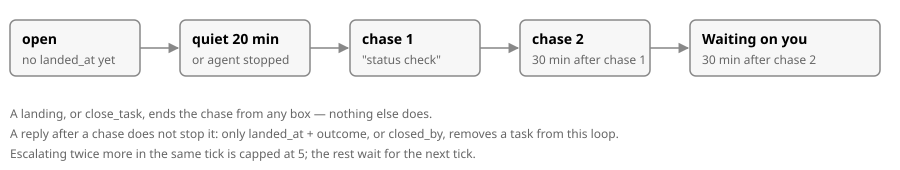

# The task loop

Nobody has to remember to land a task. [`TaskLoop.js`](../TaskLoop.js) checks every open task on a
timer, wakes its agent when it has gone quiet, and — if that gets no landing — puts the task where
the owner will see it. Design: [`skills-as-a-workflow-tasks-chased-by-nod`](/framework/ai/2026/09/28/skills-as-a-workflow-tasks-chased-by-nod/design.md).
Interfaces it agreed with its siblings: [`interfaces.md`](/framework/ai/2026-09-28/task-loop/interfaces.md).

## The timers

| variable | default | what it does |
|---|---|---|
| `SERVEX_TASKLOOP_EVERY_MIN` | 5 | how often the loop looks at every open task |
| `SERVEX_TASKLOOP_QUIET_MIN` | 20 | a task's log has not been touched this long — first sign it needs a chase |
| `SERVEX_TASKLOOP_GAP_MIN` | 30 | how long between chase 1 and chase 2, and between chase 2 and escalating |
| `SERVEX_NO_TASKLOOP` | unset | set to `1` to stop the ticking; `close_task` and `task_loop_status` still work |

A task is **open** when its `task.jsonl` has no `landed_at` carrying a non-empty `outcome`, and no
`closed_by`. The loop reads today's and yesterday's task dirs under `public/framework/ai/`,
starting from Servex's own repo root — a worktree's Servex chases the worktree's own tasks, never
the live site's.

## Chase

Once a task is open and either quiet past the timer or its owning agent has stopped or is gone
(the registry row for the agent named on the task's own line 1, or found by matching session id),
the loop sends that agent one message: land it, or say why not. It logs what happened —
`woke <id>` or `could not wake: <why>` — as a `{"log": {"chase": 1}}` line on the task's own
`task.jsonl`, never anywhere else. A second chase follows 30 minutes later if the task is still
open, whatever the agent replied in between: only a real landing, or `close_task`, stops the loop —
a reply that is not a landing keeps the clock running.

## Escalate

Another 30 minutes with still no landing, and the task goes on the owner's own list instead of
staying invisible. The loop calls `card_ask` — the tool `waiting-on-you` registers in-process, once
it exists — asking the owner to close the task or keep chasing it, addressed to the task's own
agent. Until `card_ask` is registered, it posts a plain message on the task's card instead (its
line-1 `card`, or `"live"`). Either way this is logged as `{"chase": "escalated"}`, and an escalated
task is never chased or escalated again — it stays open, visible, and waiting, until it lands or is
closed. At most 5 escalations happen in one tick; a bigger backlog spreads over the next ones.

## Close

A task can leave the loop two ways: it lands (`landed_at` with a real `outcome`), or the owner
closes it without landing. `close_task({dir, why})` is that second door — it appends
`{"assign": {"closed_by": "owner", "closed_at", "closed_why"}}` to the task's own log, the only
other line that stops the chase for good. `task_loop_status()` answers `{open, quiet, chased,
escalated, last_tick}` — the last two are how many this Servex process has done since it started;
the file itself, not memory, is what survives a restart.
