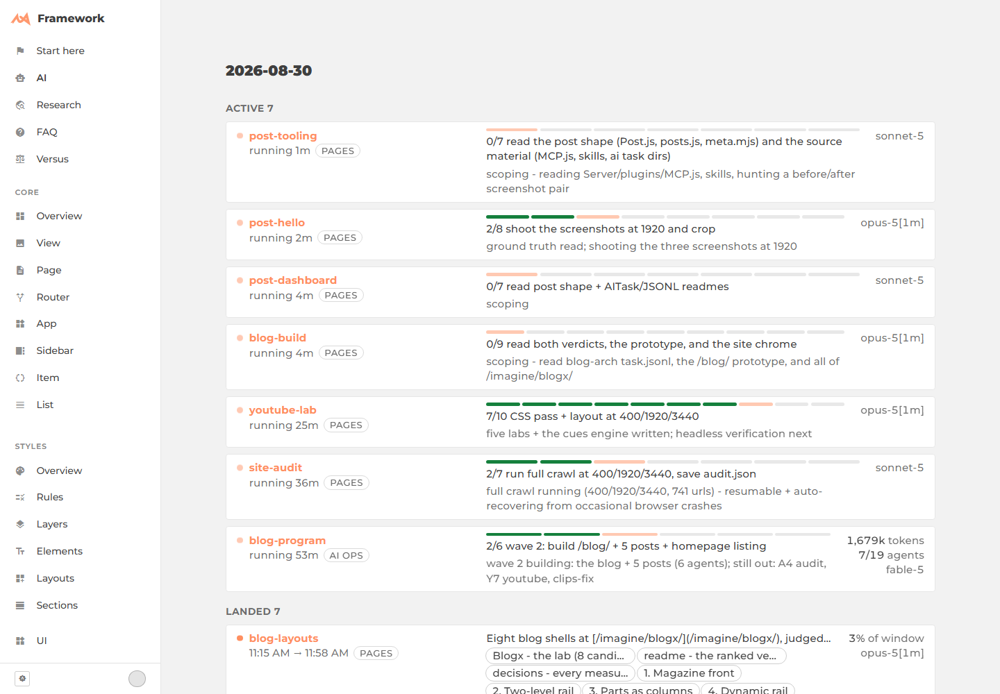
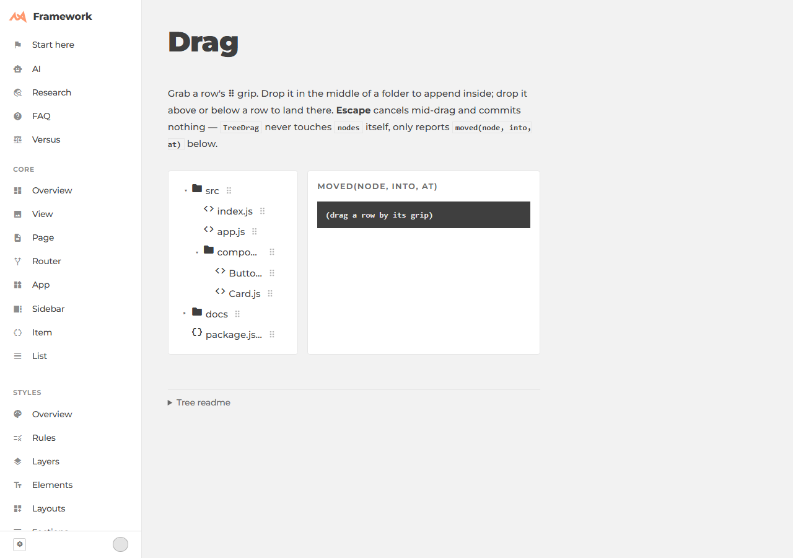
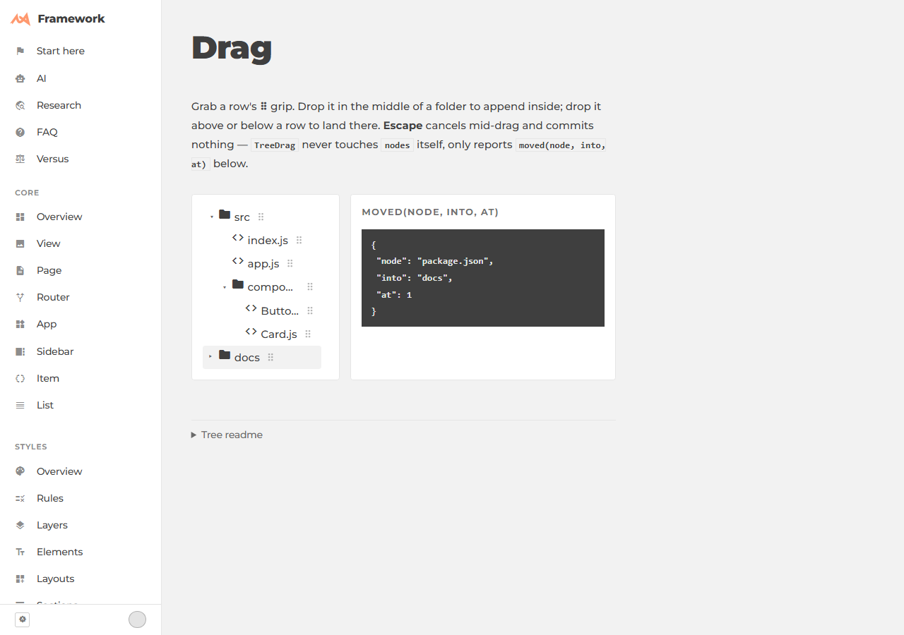

# MCP, Playwright, and skills

I designed and built the framework this site runs on; much of what gets built *with* it —
pages, demos, docs — is the work of AI agents running to my briefs, in this repo, without me
relaying what a browser showed back. The [task board](/framework/ai/) is the log of every one
of those runs, which makes the process the part you can check rather than take on trust.

That only works if an agent can see the real DOM, prove a change before calling it done, and
know the house rules without being told them fresh each time. Three pieces do that: an MCP
endpoint the dev server exposes to itself, headless Playwright as a standing verification
step, and a folder of skills that write down what they got wrong.

<figure class="blog-exhibit">



<figcaption>Seven agents on this repo at once, each logging to its own <code>task.jsonl</code>. The board is a live read of those files — nothing here is typed by hand.</figcaption>
</figure>

## Seeing the real DOM

A chat model with no eyes on the page is guessing. `Server/plugins/MCP.js` closes that gap:
the same Node process that serves the site over HTTP also answers `/mcp`, a hand-rolled
JSON-RPC endpoint with five tools — `pages` lists every browser tab connected to the dev
socket, `eval` runs JavaScript inside one and hands back the JSON result, `shot` drives a
headless Chromium to a url and returns a png, and `claim`/`release` ring a tab in orange so
two sessions sharing one browser don't drive the same window.

`eval` is the one that matters most: computed styles, element rects, app state — DOM truth,
cheaper and more exact than a screenshot for anything that isn't pixels. Every answer also
reports the tab's visibility at the moment it ran, because a hidden tab still evaluates but
stops rendering — a fact this endpoint would rather state than let an agent discover the
hard way.

<figure class="blog-exhibit">

```js /Server/plugins/MCP.js
const LOOPBACK = /^(127\.\d+\.\d+\.\d+|::1|::ffff:127\.\d+\.\d+\.\d+)$/;

if (!loopback(from)) return res.status(403).json({ jsonrpc: "2.0", id,
	error: { message: `/mcp answers loopback only; refused ${from}` } });
```

<figcaption>The server binds every network interface, and these tools run arbitrary JS in a
browser tab — so <code>/mcp</code> checks the request's own socket address before it does
anything else, on every call, not just at boot.</figcaption>
</figure>

None of it is exotic MCP plumbing — no session state, no streaming, one POST in and one
JSON object out. [`/framework/dev/`](/framework/dev/) is the public side of this tier:
[`Socket`](/framework/dev/Socket/) is the reload-and-RPC bridge these tools ride on,
[`Claim`](/framework/dev/Claim/) is the orange ring.

## Proving it before calling it done

A description of a UI change is a claim. This repo's default is to check it: every landing
page gets screenshotted at 400, 1920 and 3440 pixels wide before a task is allowed to land,
because a fix that works at one width and breaks at another is still a bug. Anything with a
gesture — drag, resize, reorder — gets driven headless and shot after every step, and a
number that matters (a column's measured width, a gap in pixels) gets read with `eval`
rather than eyeballed off a screenshot.

<figure class="blog-exhibit">

**Before** — nothing dragged yet.



**After** — one grip-drag later.



<figcaption>A real acceptance gate from <a href="/framework/ai/2026-08-21/ux-treedrag/">a
task building drag-reorder for a tree view</a>. Dropping a row onto a folder has to produce
this exact payload — checked against the DOM, not assumed from the drop looking right.</figcaption>
</figure>

That gate lives at [`/framework/ux/Tree/drag/`](/framework/ux/Tree/drag/) — drag a row by
its grip and watch the payload update live. The [decision log](/framework/ux/Tree/doc/decisions/)
for that task records five such proofs, all green, before the feature was called finished.

## Skills that remember what went wrong

The repo carries its own house rules as files under `.claude/skills/` — short, specific
instructions an agent reads before doing a kind of task: one for sizing a layout, one for
naming a CSS class without colliding with an existing prefix, one for opening a task log
before the first edit. They're triggered by what the work looks like, not typed by hand
each time.

What keeps them from going stale is a second, smaller file beside each one. The moment a
skill is silent about a trap that then bites — a naming collision it should have caught, a
step it left out — the fix is one line appended to that skill's own `improvements.md`: what
should change, and the evidence for it. A line that keeps recurring is a rule the skill
doesn't have yet; a human decides when it's time to write it in. It's the same discipline as
the screenshots — a skill that turns out to be wrong is a finding, not an embarrassment, and
the record of being wrong is what makes the next run of it right.

## Briefs, fences, verification, logs

None of this is about a smarter model. It's the ordinary shape of running an engineering
team: a written brief instead of a vague ask, a fence around which files a task may touch,
a verification step that has to pass before anything ships, and a log that says what
happened and why — readable later by a different agent, or by the person who has to trust
the result. The [daily task boards](/framework/ai/) are that log, in public, for every task
that has ever run against this codebase.
