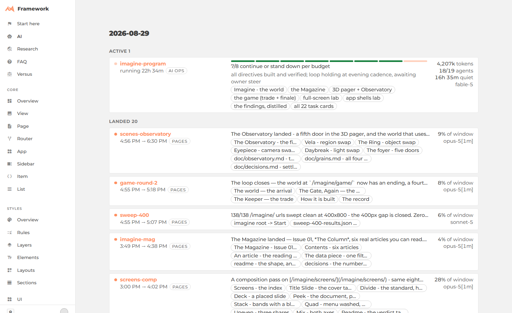
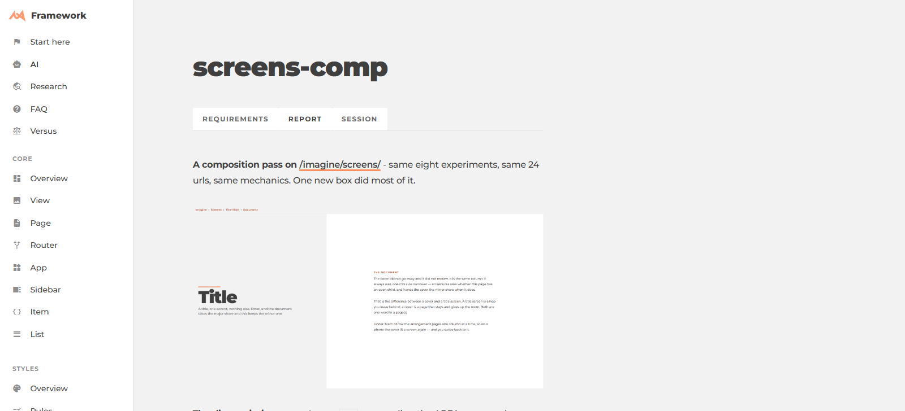
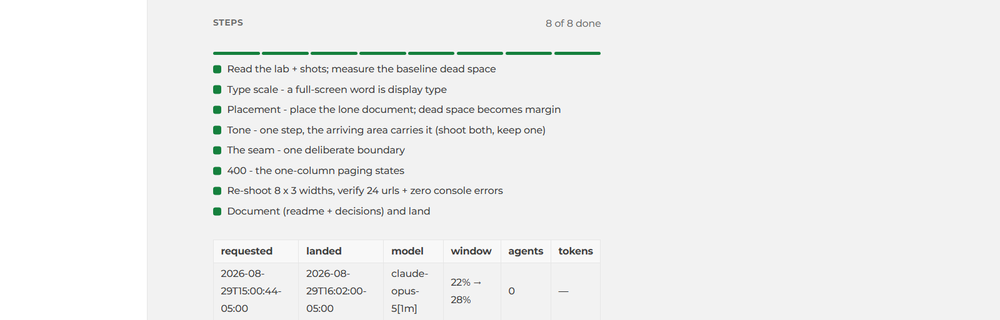

# The AI dashboard

Every AI session that touches this repo opens a task first: a directory at
`ai/<date>/<slug>/` holding one file, `task.jsonl`. An agent appends a line before its
first edit, appends more while it works, and appends a landing line when it's done.
Nothing else backs the board you're about to see — no database, no build step, one
append-only log per task.

## Why a log, not a database

One JSON object per line, one verb per key — `assign` merges onto the task's state,
`log` and `action` append to it. The reader replays the whole file from the top; the
writer only ever adds a line to the bottom. That gets you three things a database
would cost extra for:

- **Append-only.** An agent can't corrupt a task's history, only add to it.
- **Git-diffable.** `git log -p` on a task dir *is* its audit trail.
- **The viewer renders what agents wrote, not what they claim.** The steps checklist,
  the token count, the outcome — every field on screen came from a line an agent
  appended in the moment, not a summary written after the fact.

## The board, live

<figure class="blog-exhibit">

<figcaption>2026-08-29 — a 20-task day. Each card is its <code>task.jsonl</code>, replayed: title, wall-clock span, a one-line outcome, the topics it touched, tokens spent, and which model ran it.</figcaption>
</figure>

That board doesn't poll and doesn't reload. Appending to any `task.jsonl` pushes the
new line down a socket to every open tab — the dev-only half of
[`ext/JSONL`](/framework/ext/JSONL/) — so a card's progress bar moves while you're
looking at it. The alternative was tried first: reloading on every append, which
during a busy afternoon meant the board flickering out from under you every few
seconds. A day this size ran that afternoon without it ever doing that.

## One task, opened

Click a card and you get the same file rendered as a page: three tabs — Requirements,
Report, Session — with Report open by default. `outcome`, `links`, and any
screenshots the agent logged build the top; a checklist built from the same `steps` /
`step` pair that drove the card's progress bar sits underneath, so the two can never
disagree.

<figure class="blog-exhibit">

<figcaption>screens-comp, 2026-08-29 — the outcome an agent wrote when it landed, with a screenshot it took mid-task, inline.</figcaption>
</figure>

<figure class="blog-exhibit">

<figcaption>8 of 8 steps checked off, then the row every task ends with: requested, landed, model, usage window, agents dispatched, tokens spent.</figcaption>
</figure>

## Hooks write half of it

An agent doesn't have to remember to log an edit. A `PostToolUse` hook fires after
every `Edit` / `Write` / `Skill` call and appends an `action` line on its own — what
you see logged by hand is the narration: decisions, findings, verification results.
The mechanical trail comes free.

## The usage guardrail

The same rail carries a spend meter, one per usage window: a fill for percent spent,
a marker for percent of the window *elapsed*. Bar behind marker means on pace; bar
ahead means a task is burning faster than its window allows. It's a projection, not a
raw number — the point isn't "how much is left," it's "at this rate, where do I land."

## Why this exists

None of this is for show. Every card on that board is an agent that ran unsupervised
for anywhere from ten minutes to most of a day, and the log is how the work stays
checkable after the fact — what it was asked to do, what it actually touched, what it
decided not to fix. Running AI agents at this scale only works if you can audit them
as cheaply as you dispatch them. The board is the standup nobody has to attend.

More: [the AI board](/framework/ai/) · [a real day](/framework/ai/2026-08-29/) ·
[`ext/JSONL`](/framework/ext/JSONL/) · [`ext/AITask`](/framework/ext/AITask/)
