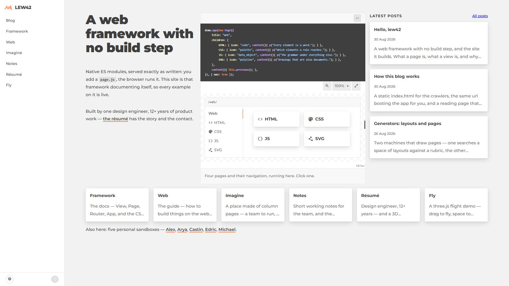
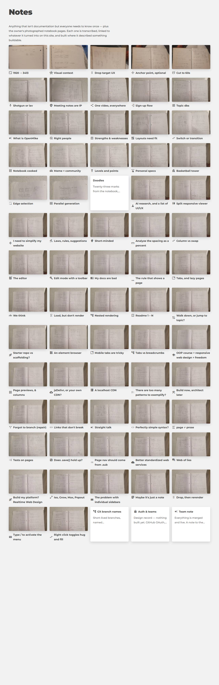
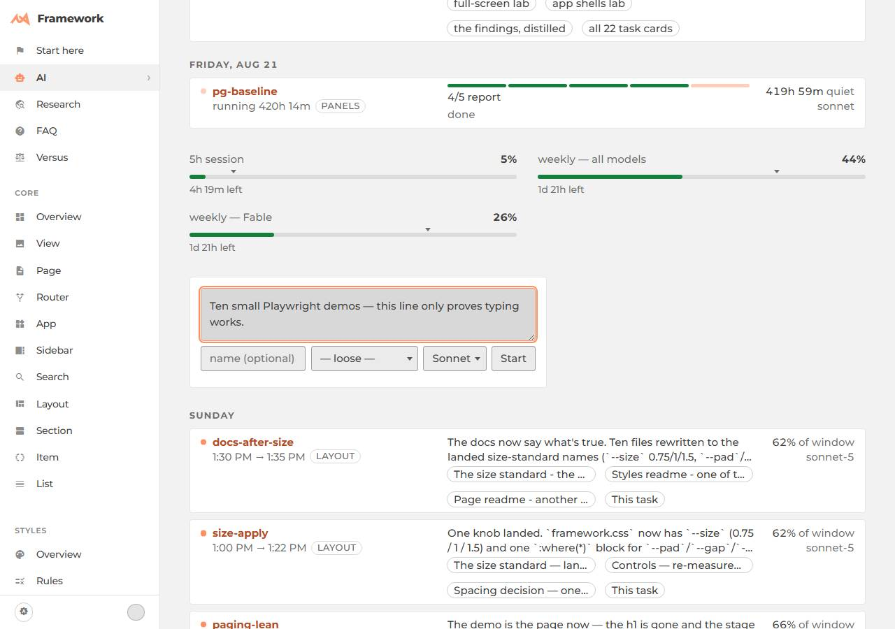
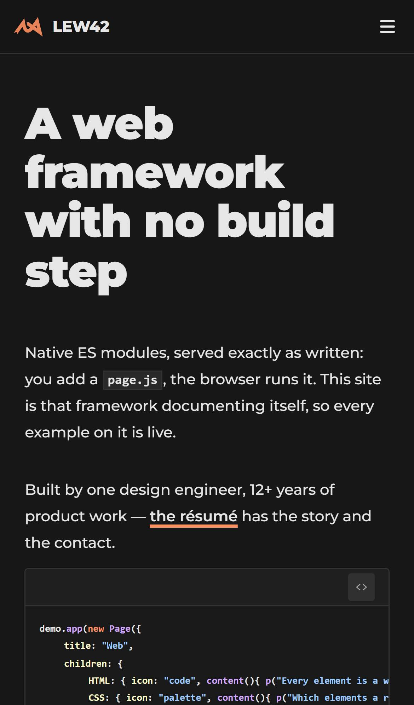
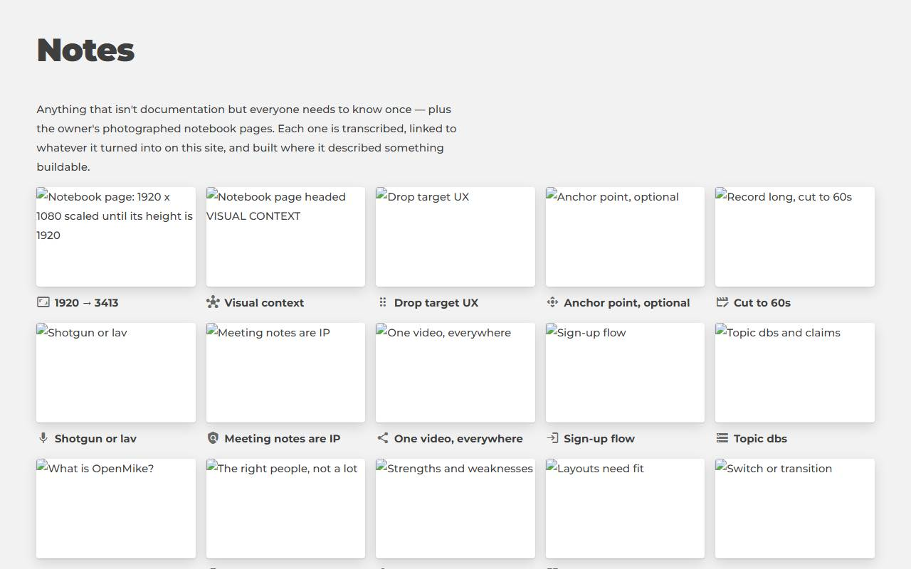
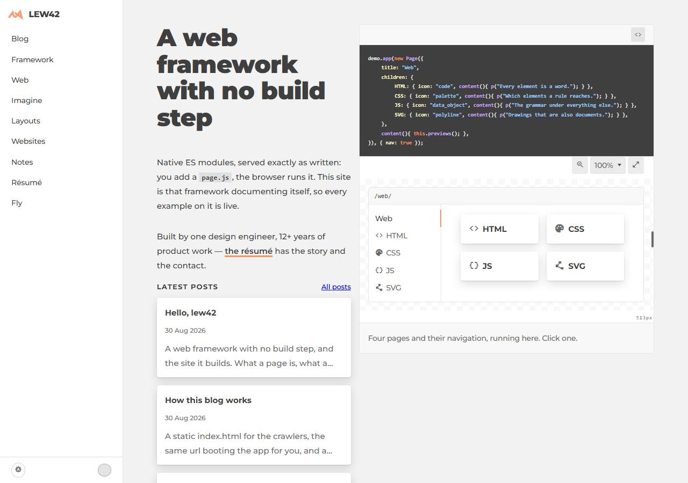
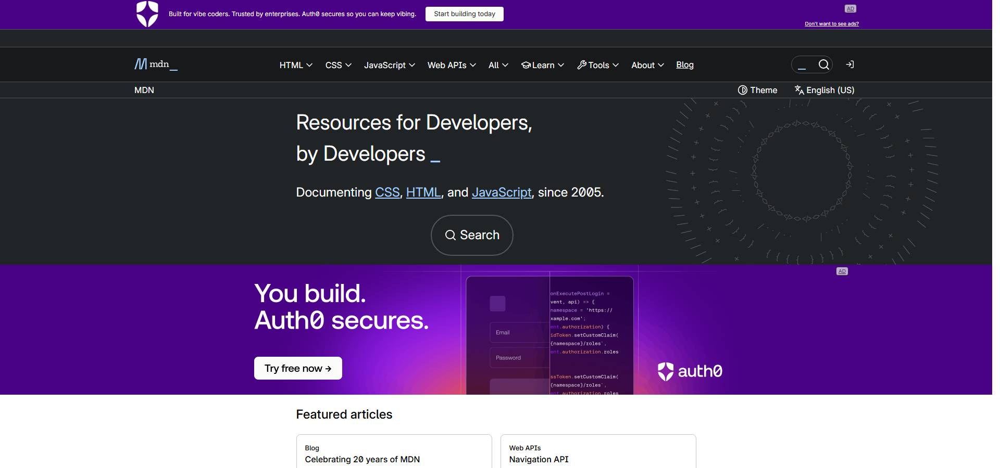

# Ten small Playwright demos

Playwright is a robot that opens a real, invisible ("headless") Chrome and can look at
a page, click it, type into it, and take pictures of it — all from a script, with
nobody watching. Each file below is one short lesson (under 45 lines) that does one
thing. Run any of them from the repo root, e.g. `node 01-screenshot-widths.mjs` — this
site must be running at `http://localhost:8123` first.

1. **`01-screenshot-widths.mjs`** — a viewport is a pretend window: the same home page at phone, laptop, desktop and ultrawide widths.
   

2. **`02-element-and-long.mjs`** — you can shoot one element alone, or make the pretend window taller than any real screen.
   

3. **`03-click-and-type.mjs`** — Playwright clicks and types like a person, and waits for things to appear on its own (no submit button was ever pressed).
   

4. **`04-emulate-phone.mjs`** — a "phone" is just a settings bundle: `pw.devices["iPhone 13"]` plus dark mode plus reduced motion.
   

5. **`05-read-the-page.mjs`** — a page is data, not just pixels: headings, links, landmarks and computed CSS, read straight out of the DOM (prints JSON, no picture; also shows the CSSOM trap — a cross-origin stylesheet's rules can't be read directly).

6. **`06-network.mjs`** — Playwright sits between the page and the internet: it can block every image request and hand back fake JSON for another.
   

7. **`07-pdf.mjs`** — a browser is also a printer: `page.pdf()` turns a live page into a real PDF file (prints its size and page count; the file itself stays in the scratchpad, not this repo).

8. **`08-trace-and-video.mjs`** — every run can be replayed later: a step-by-step trace and a literal video file, both recorded while the script drives the page (prints their sizes and `npx playwright show-trace <file>`; kept in the scratchpad).

9. **`09-aria-snapshot.mjs`** — this text tree (`ariaSnapshot()`) is what an AI agent reads instead of a picture — it's how `@playwright/mcp` lets a model drive a browser blind.
   

10. **`10-external-site.mjs`** — the whole web is reachable, and some of it says "don't embed me": example.com allows framing, MDN refuses it with `x-frame-options: DENY`.
    
