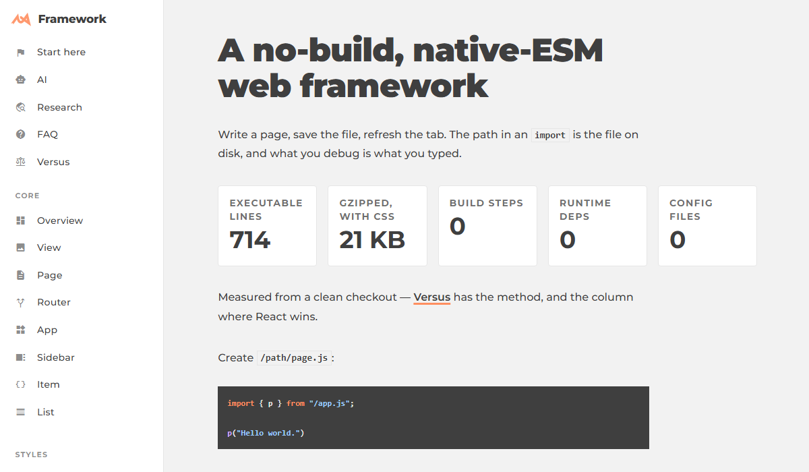

# No build step

There is no compiler between the file I save and the code the browser runs. `public/` **is**
the site: the path in every `import` is a real URL, a stack trace names my file at my line
number, and view-source is the source.

That one constraint decides everything else in this post.

<figure class="blog-exhibit">



<figcaption>The framework's own front page. Those five numbers are measured from a clean
checkout — the method, and the column where React wins, are on
<a href="/framework/versus/">Versus</a>.</figcaption>
</figure>

`View`, `Page`, `Router` and `App` are **714 executable lines** between them, and 21 KB
gzipped is *everything* it takes to render a page, CSS included. The point is not the byte
count — it is that you can read all of it, and there is no build output to read instead.

## The whole boot

`index.html` is a shell with an empty body and one script tag:

```html /index.html
<meta charset="utf-8">
<title>lew42</title>
<script type="module" src="/app.js"></script>
```

`app.js` builds the chrome once — nav, theme, the region pages mount in — and then asks for
the page at the current URL. That is `App.load()`, copied here whole:

<figure class="blog-exhibit">

```js /framework/core/App/App.js
async load(){
	try {
		// the only page handed `app` directly; every other gets it from its
		// parent on the walk, in Page.child()
		this.root = (await Page.load("/"))?.assign({ app: this });
		if (!this.root) throw new Error("no /page.js — the root is the one page that must exist");

		this.router = new Router(this.router, { app: this });

		if (!await this.router.load(location.pathname))
			throw new Error(`404 — nothing matches "${location.pathname}"`);
	}
	catch (error){ return this.error(error); }

	await this.loaded();
}
```

<figcaption>Load the root page, hand it the app, walk to the URL, wait for the stylesheets.
Nothing is registered anywhere; there is no route table to keep in sync.</figcaption>
</figure>

The last line is why there is no flash of unstyled content: the page is built detached and
injected only once every stylesheet has resolved.

`Page.load()` bottoms out in one line — `(await import(url + "page.js")).default` — so the
URL is the import path. `/framework/core/Page/` is served by `/framework/core/Page/page.js`
because that is literally what the router asks the browser for:

<figure class="blog-exhibit">

```js /framework/core/Router/Router.js
// The walk IS the loader: each hop awaits page.child(name), which imports on a
// miss — so when this returns the whole chain exists, with parent and app set.
async load_segments(url){
	let page = this.app.root;

	for (const name of url.split("/").filter(Boolean)){
		page = await page.child(name);
		if (!page) return null;
	}

	return page;
}
```

<figcaption>Six lines, and they are the router. Code splitting is not a feature here — a
page's module is fetched the first time somebody walks to it, because that walk is the only
thing that imports it.</figcaption>
</figure>

A page, then, is a file that draws something. Complete and working:

```js /hello/page.js
import { p } from "/app.js";

p("Hello world.");
```

Save it, open `/hello/`, and it is a page.

## What it costs

Honestly: no JSX, no dependency ecosystem, no framework-shaped hiring pool, and I write the
CSS. What I get back is that nothing in the stack is a black box — when a page misbehaves,
the file open in my editor is the file in the debugger, and the fix is one save away.

I keep that argument on one page rather than making it here.
**[Versus](/framework/versus/)** has the measurements and the column where React is the right
answer; [Start here](/framework/start/) is the tour and the [FAQ](/framework/faq/) takes the
"but what about…" list.
