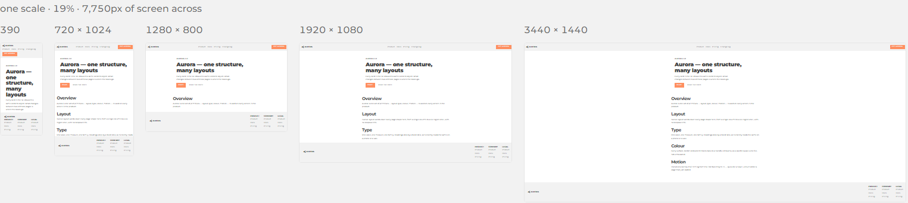
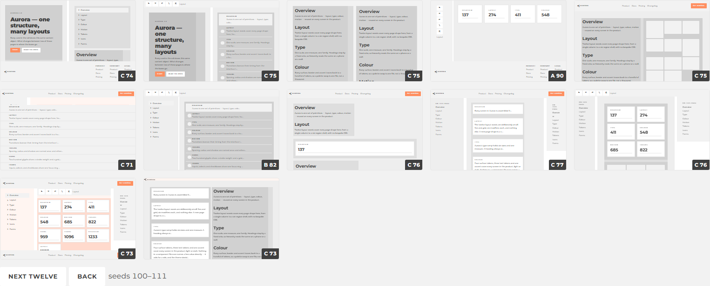
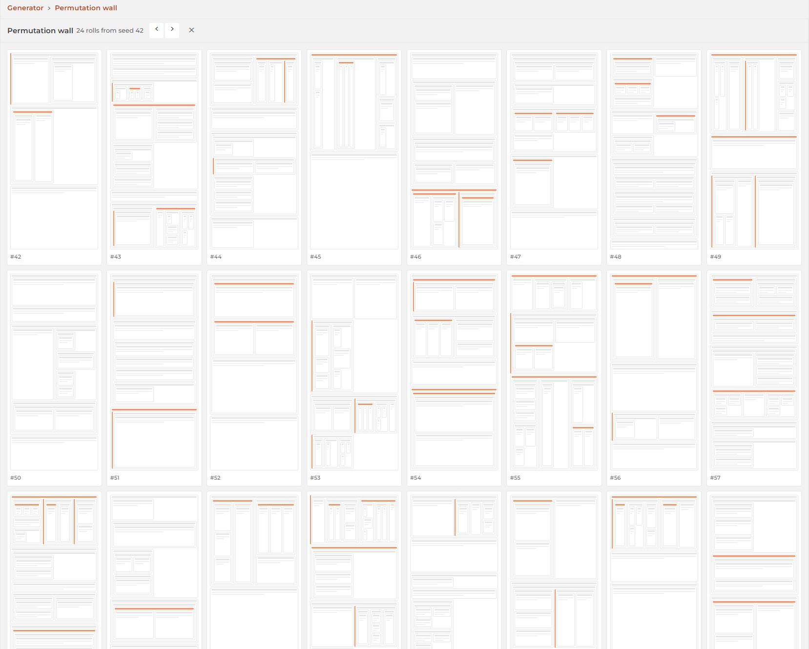

# Generators: layouts and pages

Two modules here build something real — a rendered layout, a live page tree — out of
nothing but an integer. Neither keeps a library of examples. Each keeps a *model*, a
plain table of weights, and an integer picks a path through it. Same integer, same
result, forever; change the table, and every existing integer now points somewhere
else. That's the whole idea, applied twice.

## A layout is a string

[`styles/layouts/space/`](/framework/styles/layouts/space/) starts from an observation:
every hand-written layout in the framework's demo rail is the same tree — a nest of
class strings around parts of one shared `site` object. So a layout isn't code, it's a
string:

```
full fill flex v
  > topbar
  flex gap wrap flex-1 scroll
    basis pad --basis:15em > menu
    pad flow fluid > sections 5
    basis pad --basis:13em stick > toc
  > footer
```

Indentation is nesting, a line is `<class tokens> > <part> [count]`, and a token holding
`:` is a declaration rather than a class. Type that into the lab and it renders live at
five widths in one row, one scale — because a screen is a width *and* a height, and a
layout that's fine at 1920 can be broken at 390 with nothing down there to divide.

<figure class="blog-exhibit">



<figcaption>The lab: edit the text, watch it render at five widths simultaneously.</figcaption>
</figure>

`gen(seed)` skips the typing. It draws the same string forever from a `mulberry32`
pseudo-random generator seeded by that one integer — `#7` isn't a save file, it's an
address. Open it in any browser and the tree is identical, because what shapes it (which
arrangements exist, which parts belong in which role, how wide things get) is a fixed
table in `model.js`, not a coin flip.

<figure class="blog-exhibit">



<figcaption>Twelve seeds at a time, each a link back into the space it came from.</figcaption>
</figure>

The rail's own [taste tier](/framework/ext/DesignTool/taste/) scores each roll against
eleven ideal ranges, and [`hunt/`](/framework/styles/layouts/space/hunt/) turns that into
a search: roll a hundred seeds, rate each at three widths, rank by the *worst* one — a
layout that's an A on desktop and an F on a phone isn't a B layout — then credit every
weight by the mean score of the rolls that used it. That credit table prints right next
to the weights currently live, so retuning the model is an argument you can see, not a
guess.

## Pages, with no files on disk

[`core/Page/generator/`](/framework/core/Page/generator/) points the same idea at the
framework's own page tree. A seed draws a spec string, and the spec builds a *real* page
tree at the generator's own url — real urls, the real Router, columns, tabs — without
one file on disk. The mechanism is a single line: `Page.declare()` already accepts a
nested array of plain objects and turns each into a real `Page`, recursively.

Five words, and each one says where a child goes when you pick it:

| word | picking a child |
|---|---|
| `wall` | opens a new column, right — cards |
| `list` | opens a new column, right — an inbox: previews, then detail |
| `prose` | the leaf — no children |
| `tabs` | swaps in place, same column, under a strip |
| `vtabs` | the same, beside a rail |

Nine words shipped first; four were cut once the framework's own rule — a word earns
codification only if it changes *where a child goes* — got applied to them. `grid` was
just a `wall` with a smaller cell, `flush` a `wall` with no gap: pictures, not behavior,
so they're a few lines of plain `new Page()` in [the readme](/framework/core/Page/generator/readme/)
instead of a word.

Every column head carries menus for its own two words, and a control never touches a
live column directly — it rewrites one line of the spec text and the tree regrows from
that. So a switched tree is a link (`#s=<the encoded spec>`), a reload lands on exactly
what you built, and the seed underneath stays untouched.

<figure class="blog-exhibit">



<figcaption>The <a href="/framework/core/Page/generator/rolls/">permutation wall</a> — same seed range, one click deep into any tile.</figcaption>
</figure>

Underneath the tiles sits a table of which word may follow which — a multiplier per
pair, printed so you can argue with it, exactly like space's credit table above it.

## One rule, twice

A seed is a citation inside one version of the model, not the model itself — retune a
weight and every old seed now points at a different layout or a different tree, the same
way editing a source changes what a citation means. Both generators prove they've earned
the word: `gen(seed)` reruns in the background on every repaint and the two strings are
diffed, because a seed that can't reproduce itself bit-for-bit isn't an address, it's a
coin flip with a serial number stapled to it. And in both, what a seed draws *from* — the
shape weights, the pairing rules — is data, not code: a plain table sitting next to the
pictures it produced, so changing it is a decision with evidence attached, not a guess.
