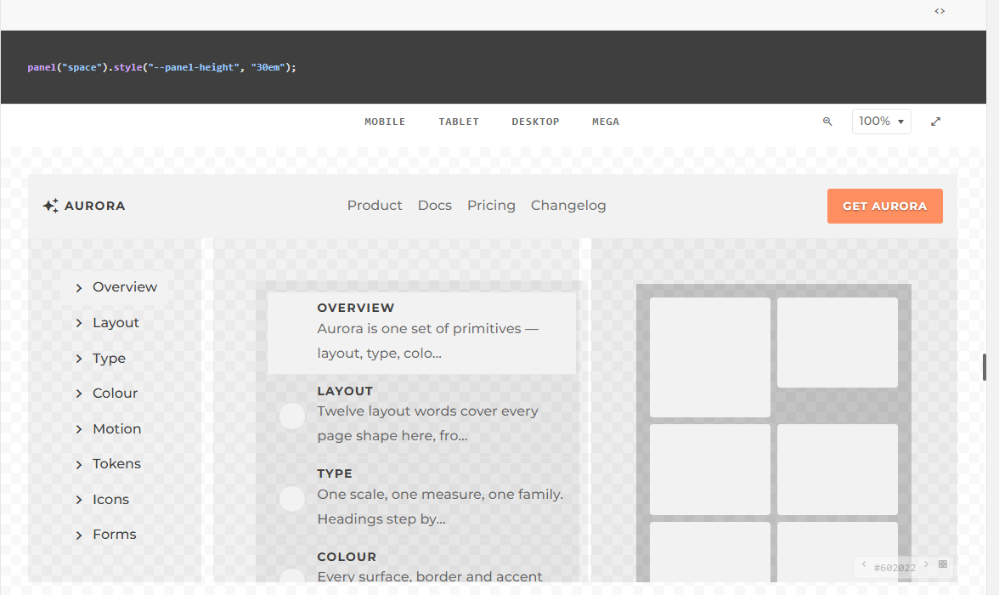
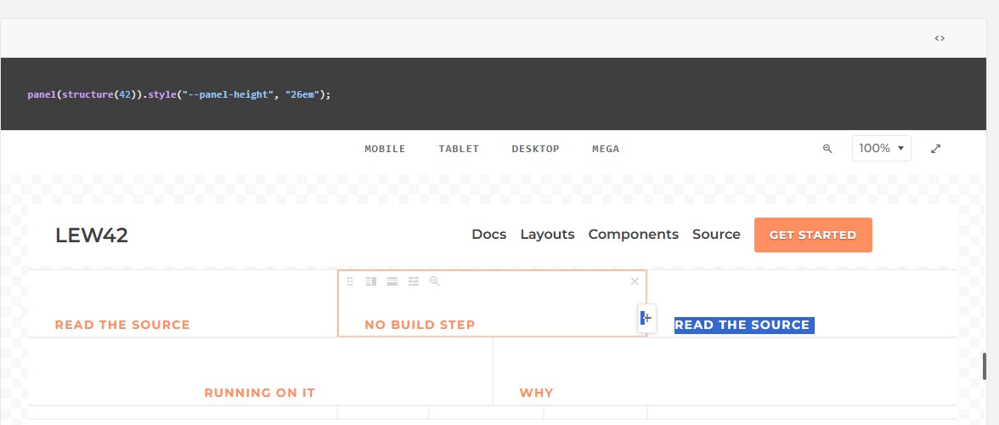
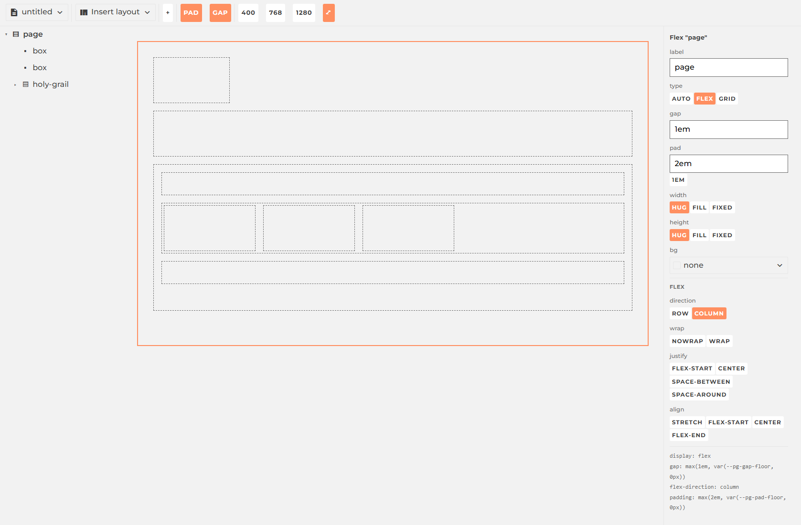
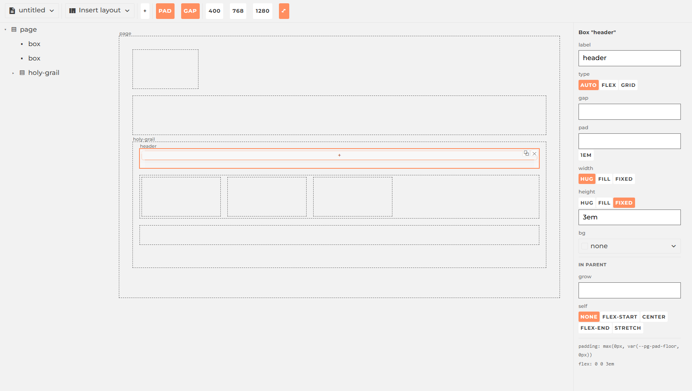

# Panel and Playground

Two tools in this framework let you build a page by dragging boxes instead of writing
markup. They sound like the same idea wearing two skins. A line-count audit run this week
says otherwise: **zero shared imports** between them. Different mechanism, different job,
built months apart for different reasons. Here's what each one actually does.

## Panel: wireframe by hand, not in code

[`ext/Panel`](/framework/ext/Panel/) is chrome for arranging — divide, drag, align, fill
and persist any region. Twelve gestures live on one panel: click an edge to split it, drag
a seam to resize, alt-drop to duplicate, pick `hug`/`fill`/a fixed length per axis. None of
it ships. The line on the tin is honest about that: *"for wireframing pages, not shipping
them."*

The gesture worth showing is the one that ties the whole module together. `space` — a
generator in [`styles/layouts/space/`](/framework/styles/layouts/space/) — turns one integer
seed into a whole generated page, drawn as a *picture*: nav, hero, a card grid, nothing
draggable.

<figure class="blog-exhibit">

<figcaption><code>panel("space")</code> — the same seed always draws the same picture.</figcaption>
</figure>

`structure(seed)` takes the *same* seed and walks it a second time, emitting real `Panel`s
instead of `div`s. Same integer, same tree, forever — but now every band is a leaf you can
grab.

<figure class="blog-exhibit">

<figcaption>Point at a translated band and its bar appears — this one is genuinely alive, not a screenshot of one.</figcaption>
</figure>

That's the whole pitch: a picture to look at, then the identical layout as something you
can pull apart. `Panel` doesn't care what's inside a leaf — the picture and the persisted
document underneath the module's own demo page are the same class doing two different jobs.

## Playground: the data IS the CSS

[`ext/Playground`](/framework/ext/Playground/) starts from the opposite end. There's no
picture step — every document is real flex/grid DOM from the first frame, and the sidebar
you edit it from is a direct readout of `node.style`. Select a box, and the panel on the
right doesn't show a *representation* of its CSS. It shows the CSS.

<figure class="blog-exhibit">

<figcaption>Every control on the right writes one declaration. The bottom lines are that declaration, verbatim.</figcaption>
</figure>

Pick a plain `Box` instead — the header band of the default holy-grail document — and the
field set changes shape entirely: a Box has no `direction` or `justify` to offer, but it
gets a `grow`/`self` pair for how it sits in *its* parent.

<figure class="blog-exhibit">

<figcaption>A different node, a different vocabulary — because the sidebar reads the box, not a schema.</figcaption>
</figure>

There's no generator here, no seed, no address to reroll. The one saved subtree *is* the
reusable layout — copy it, paste it, and the JSON you moved is the CSS you'll get.

## What they actually share

The audit's numbers are blunt: Panel is roughly three times the code, with four real
callers elsewhere in the framework; Playground has none — it's reachable from the nav and
nothing else imports it. Different weight classes, doing different work.

The one place they genuinely rhyme is sizing. Both hand-roll their own version of
`hug | fill | fixed` per axis — Panel's in an 11KB stylesheet, Playground's as a function
in `items.js` — and neither has ever read the other's. That's not a design decision, it's
two people solving the same three-way choice twice. It's also the one real candidate for
becoming a single shared module, someday. Everything else about these two tools earned its
own code honestly.
