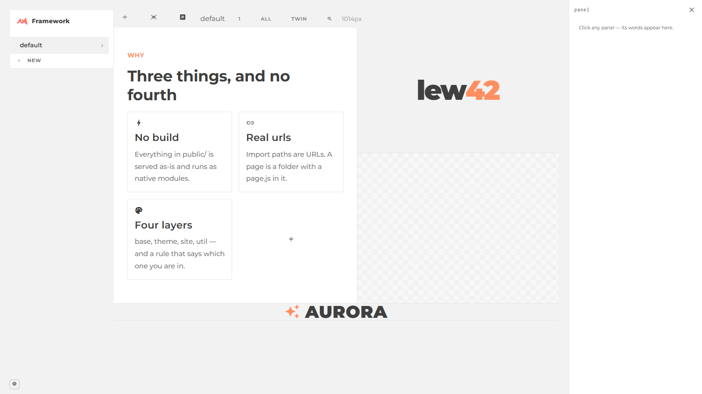
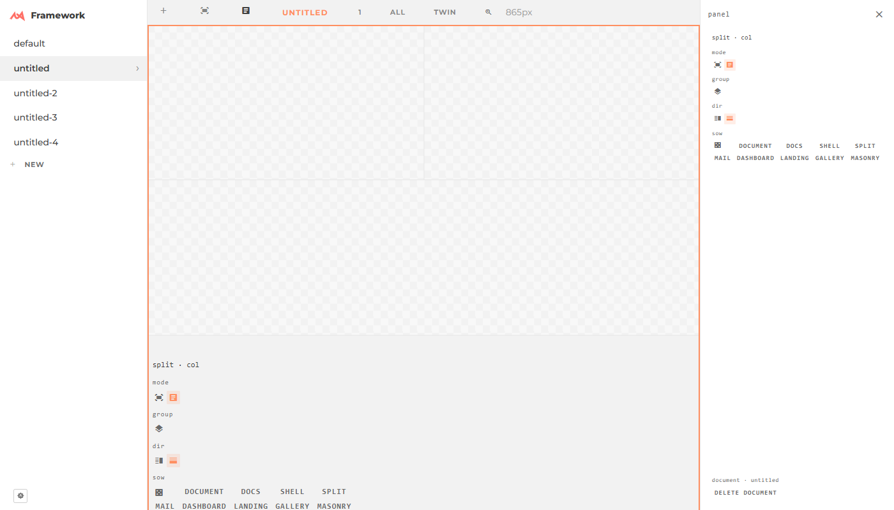

# Run 4 — 2026-08-19 — the Workspace MVP, then the owner's day of input (#1–33)

One screen. Every line is clickable from the day board; detail lives in each task's log.

## Landed (14 tasks, ~3.0M subagent tokens; zero console errors on every Panel page at the end)

| Task | What | Proof |
|---|---|---|
| [workspace-design](../workspace-design/) | the approved plan: Workspace holds a root, no container queries, hug = auto, documents = files, split vs add | — |
| [workspace-a-sizing](../workspace-a-sizing/) | containment gone; `--panel-section` floor; `doc/sizing.md` | measured heights |
| [workspace-b-module](../workspace-b-module/) | `ext/Panel/Workspace/` class + `documents.js` (`/data/panels/<name>.json` + index) | N views of one root |
| [panel-demos](../panel-demos/) | Panel › Demo: 12 UX demos, recorded flow beside a follow-along | flows replay |
| [panel-groups](../panel-groups/) | drill-down selection; centre-drop nests into with padding | pointer drags |
| [workspace-c-playground](../workspace-c-playground/) | `/playground/`: document rail, viewports fill/one/all/twin, Fit/100%/zoom, drawer grip as the handle |  |
| [workspace-d-verbs](../workspace-d-verbs/) | edge = split (twin via `restyle`), bar `+` = add; insert stub off the grip; group toggle on the bar | twin words equal |
| [panel-pad-gap](../panel-pad-gap/) | `pad` word + knobs on `pad`/`gap` | computed px |
| [panel-bar-sweep](../panel-bar-sweep/) | bar 15 → 6 buttons; clipped popovers 365 → 0; `ext/Dropdown` (top layer); toggles; tone 1×4 | before/after pngs |
| [panel-flow-sizing](../panel-flow-sizing/) | a panel is a div: `h: hug`, `--panel-min` 5em; right/bottom edge click-split · drag-resize · right-click-reset; a split halves the struck share (25/25/50) | 150/150/300 |
| [panel-items](../panel-items/) | flex/grid cells selectable; per-item words `--item-*`; `data.items` | flexGrow 2 on one cell |
| [panel-selection](../panel-selection/) | one selection per page; rings cleared document-wide; clicking off deselects; hover = what a click selects; `+` on hover | 7 boxes, 1 panel |
| mastermind inline | Workspace left rail; `.tabs.vertical` = `wide` (bleed rule); playground padding + `PlaygroundRail`; text-click drill; insert stub past the bar; document select + red Delete; `views` holds every rendering; `LEW42`; 17 JSONL lines repaired |  |

## Waiting on the owner

`ext/layout` `refresh()` rail ownership (sweep proposal) · nested-Doc left-rail rule for `core/new/0,1,starter` + `DesignTool/taste` · run 3's lists: Panel park/delete, CSS audit's five, push blockers (`ai/**` served static, `.gitignore`, shots) · the two `self` rows in the rail (leaf vs item) · sections default to `group: on` in a document (first click = section).

## Process, for the record

Three live errors reached the owner from one minion's in-progress edits → every brief now says `node --check` + headless-load after every shared edit. A minion killed the dev server; another `git stash`ed a sibling's file; a parked agent was re-dispatched as a duplicate → all three are rules in the mastermind skill now. Cost pace held: weekly 90% at 96% elapsed.
