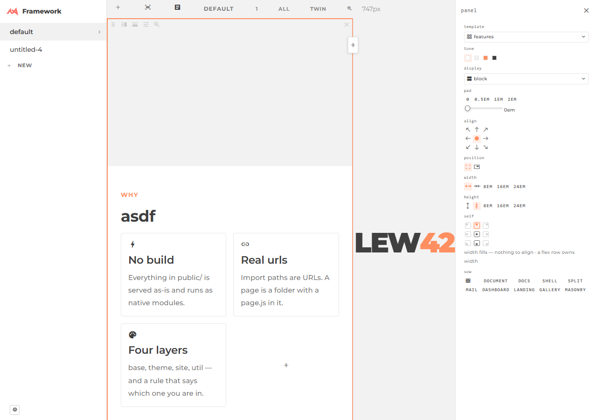

# Panel, read — what to carry into `ext/Playground`, and what to avoid

45 files · 4,362 JS · 1,514 CSS · 3,303 doc lines. **Zero console errors** on all four pages at 1280
and 3440. Not broken so much as **over-specified**: nearly every mechanism below is sound, there are
simply far too many, and two modules quietly fight over one rail.

## 1. Item → DOM
`Panel extends Item` (`Panel.js:9`) — five structural verbs, nothing else: `divide` `split` `close`
`absorb` `bequeath`. All state is `item.data`; `Panel.defaults` (`Panel.js:182`) answers what nobody
chose, so only real choices serialize. **One listener at the root, STRUCTURE only**
(`workspace.js:93-94`): `add`/`remove` rebuild every mounted box, `change` deliberately does not — it
would replace the element its own control is holding (`workspace.js:64-67`). Everything else is a
hand-written `repaint(item)` (`paint.js:26`) re-running `sizing` + `show` + `paint`. Fragile, because
**the two paths are kept in sync by hand**: `mode` must fake a structure event (`Panel.js:40`), and
`repaint_mirrors()` repaints *every* linked panel on *every* change (`paint.js:73-84`).

## 2. Persistence + documents — the cleanest thing here
`Workspace/documents.js` is 64 lines and is the whole store: `list/open/create/remove`,
`/data/panels/<name>.json` + a self-written `index.json` (`:19-20`) — never `directory.json`, which
ignores every `.json` (`Server/plugins/Directory.js:21`). `:14-15` picks `FileSaver` on localhost,
`LocalStorageSaver` off it. **Reusable by import, verbatim.** `Item.open(saver)` is the only async
entry; `load()` rejects on a real failure but resolves `null` for a missing file, and
`Workspace.js:52-56` seeds only on `null` — get that branch wrong and a document is wiped.
`persist.js` (243 lines) is *not* this: it is the text/item overlay, keyed `scope/path` so an edit
survives the `paint()` that throws the drawing away (`:70,81`) — powerful, expensive, skip in v1.

## 3. Sizing, after today's cq removal
Two axes, three words: `w`/`h` ∈ `fill | hug | fixed` (`size.js:44`); `hug` is plain `auto`, no
container queries anywhere. Default `w: fill, h: hug` (`Panel.js:182`) — a panel is a div in flow,
its height is its content, adding a child *grows* it. A seam drag writes a **ratio** (`--panel-grow`,
`grip.js:16`); an edge drag writes an **em length to the quarter** (`split.js:120`). Both survive any
screen. `fixed` caps with `max-block-size: 100%`, never `min(x,100%)` — a percentage *size* against
an indefinite parent resolves to 0 (doc/sizing.md §4). **Simplest honest version:** `--panel-grow`
per child, `flex-grow: var(--panel-grow,1)`, `height: auto` — two declarations and one number get
~80% of `size.js` (138 lines) + `size.css` (11.5KB); `self`/`position` are the rest.

## 4. Properties panel
One function, `fields(target)` (`properties.js:42`), reading one table — `WORDS` (`glyphs.js:123`).
A row is `{names, pics, cols, toggle, drop, knob, modes, root, var, css}`; add a row, get a control.
Every click is `target.set(key, value)` then `apply()` (`properties.js:135`) = `repaint(target)` +
**re-dispatching `panel-focus`**, because the rail cannot redraw itself. **Wonky, measured:** the
rail is a SHARED `ext/drawer` with a second owner — `ext/layout` wires `$rail.on("click")` once and
never unwires it (`properties.js:150-162`). At 1280 today: select a panel → 10 Panel rows; click the
bar's `+` → **ring still lit on 7 renderings, rail now reads "nothing selected · Click a box inside
any region"** — ext/layout's words, not Panel's. Same after a mode switch. One rail, two writers, no
ownership test. This is the owner's "wonky".

## 5. Gestures — fifteen
split (edge click, `split.js:42`) · add (`Workspace.js:127`) · close · focus/drill (`focus.js:93`) ·
seam drag (`grip.js:19`) · seam menu · edge drag-resize · edge right-click reset (`split.js:60`) ·
drag-to-reorder · drop-on-edge · drop-on-centre to nest (`PanelDrag.js:69`) · alt-drop to mirror
(`PanelDrag.js:39`) · insert `+` at a seam · zoom scrub (`tools.js:135`) · flow replay (`flow.js`).
Over-built, worst first: **alt-drop mirroring** (`master`/`shared`/`bequeath`/`copies`,
`Panel.js:45-85`, for a gesture nobody finds), **flow replay**, **zoom scrub**, the **insert `+`**
(inset 0.7rem so it stops eating a nested seam drag), **seam menu**, **drop-on-centre**. Ship four:
split · drag-a-seam · close · select.

## 6. The shell — reusable as-is
- **`Workspace` HOLDS a root, never extends it** (`Workspace.js:23`) — or `toJSON()` writes chrome
  into the document file. **N boxes, one root**: `mount()` grows `$roots[]` (`Workspace.js:90`) and
  `roots` is a WeakMap of root → Set (`workspace.js:62`) — one listener set, one save queue. Two
  separate `Workspace`es on one file still race.
- `Workspace/viewports.js` (192 lines) — fill/one/all/twin, seven boxes mounted ONCE (no `unmount`),
  a switch shows/hides. Reusable, and the most expensive thing in the shell.
- `playground/page.js` (111 lines) — `route(name)` claims any segment so `/playground/` and
  `/playground/<name>/` share one builder (`:104`); `PlaygroundRail extends Sidebar` replaces only
  `menu()`. **Copy whole.** The drawer's `ext/grip` is the responsive handle — no code at all.

## 7. Broken, measured — headless, 1280 and 3440
Console errors **0** and horizontal page overflow **0** on `/ext/Panel/`, `/playground/`,
`/Workspace/`, `/demo/`, both widths; nothing visible lands outside its panel. Visible panels: 96 ·
15 (7 viewport boxes) · 2. **`/Workspace/` draws 7 of 14 panels at 0×0 at 1280, 6 of 12 at 3440** —
eight independent `Workspace`es, each loading its own file. Its two 404s are another module's.
Five gestures at 1280 on `/playground/`:
1. **Select — works, but takes two clicks.** Click 1 lands on the enclosing group, click 2 on the
   leaf you pointed at (`focus.js:93`). Ring on 7 renderings = 1 panel × 7 boxes; Escape clears it.
2. **Split (edge click) — works.** Ghost appears; panels 16 → 17.
3. **Add (bar `+`) — works, 15 → 16 — and blanks the rail** (§4).
4. **Seam drag — works on one axis only.** Horizontal: `409×1203 / 339×1203` → **`528 / 219`** after
   +120px, exact. Vertical, inside `mode: document`: `219×963 / 219×241` → **unchanged** — the grip
   hovers, says "Drag to resize", and does nothing (a document's block axis takes `flex-basis: auto`
   and never divides). **A visible handle with no effect.**
5. **Mode switch — works** (7 `.panel-mode-document` → 0 → 7), and blanks the rail too.
6. **Hit targets overlap.** A grip's own box is **0px wide** (an overlay strip is the target); the
   four edge strips are **14px each** on a 409×1203 panel — near the 5em floor the corners are edge,
   not body: a click at (40,40) inside a body was eaten by `.panel-edge-t`. 

## Carry
- Structure changes through **verbs on the tree**, never on the DOM — `Panel.js:92-168`
- **One listener at the root; only `add`/`remove` redraw** — `workspace.js:93-94`
- **Defaults in a class table, not in `data`**, so only choices serialize — `Panel.js:182`
- **A seam writes a ratio, a size drag writes `em` to the quarter** — `grip.js:16`, `split.js:120`
- **`hug` = `auto`** — no container query, no declared floor pretending to be a hug — `size.js:44`
- **`Workspace` HOLDS the root; N boxes, one root, one Set** — `Workspace.js:23,90`; `workspace.js:62`
- **`documents.js` whole** — an index file, not `directory.json`; the localhost line at `:14-15`
- **Seed only when `load()` resolves `null`**, never on a rejection — `Workspace.js:52-56`
- **One `WORDS` table drives every control** — `glyphs.js:123`, `properties.js:42`
- **`route(name)` — one builder for `/x/` and `/x/<name>/`** — `playground/page.js:104`

## Avoid
- **A rail you do not own.** A second module's never-unwired listener blanks it — measured §4, `properties.js:150-162`
- **A control surface that cannot redraw itself.** `apply()` re-dispatches `panel-focus` to repaint the rail — `properties.js:135`
- **Fifteen gestures.** Ship four; every extra one bought a hit-target conflict — §5, §7
- **Live duplicates (`mirror`).** Five mechanisms plus a walk-every-panel repaint per change — `Panel.js:45-85`, `paint.js:73-84`
- **A gesture that is legal but inert.** The grip inside `mode: document` — §7.4
- **A second way to say the size.** `mode: fill|document` re-reads every rule as a lens — `Panel.js:19,27`, `size.js:36`
- **`hug` on a split** — it measures children that size themselves from it and collapses to 0px — `properties.js:57`
- **Chrome the payload must know about** — `--panel-bar-h`, `.panel-controls`, five overlay surfaces on one z-budget
- **Overlays keyed by DOM child-index path** — works, but 243 lines + a MutationObserver per body — `persist.js:81`
- **Changing a default late.** `self: "tl"` and `h: "hug"` each need a paragraph on which saved documents they move — `Panel.js:171-181`
