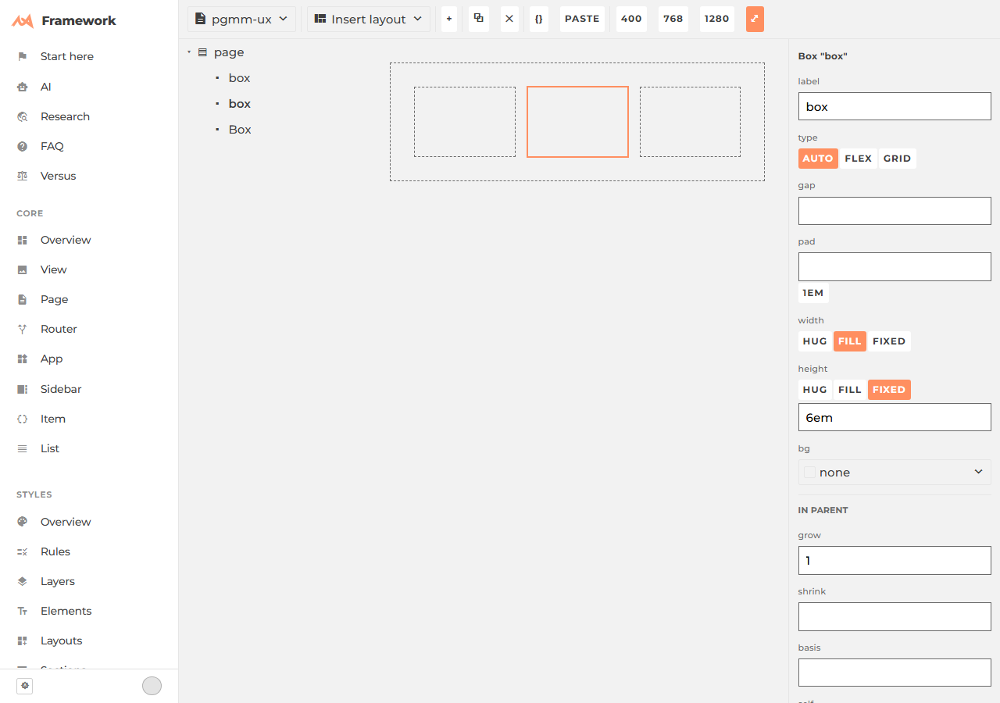

# Compacting ext/Playground — one affordance, not three

## The measurement first

**Every hover reflows the whole document.** `.pg-add` is `div.c("pg-add", "+")`, the last
*in-flow* child of every node (`canvas.js#Canvas.render`), revealed by `.pg-node:hover > .pg-add`.
CSS `:hover` matches every ancestor, so pointing at one leaf reveals up to three `+` at once.

Measured on a 3-level, 10-node document (plan + numbers: [`jank-sweep-plan.json`](./jank-sweep-plan.json)):

| hovered | nodes that moved | viewport height | worst single shift |
| --- | --- | --- | --- |
| the root | 9 of 10 | unchanged | 22px x, 10px w |
| **any other node** | **10 of 10** | **152 → 182px (+30)** | 22px x, 30px h |

Returning to neutral restores the baseline exactly — nothing is corrupted, the layout *breathes*
on every hover. It is bad enough to break automation: once a node's parent is a row, its `+`
is a narrow strip that reflows out from under the pointer the instant it appears, and Playwright's
`hover` times out after 30s trying to land on it.

`.pg-resize-handle` already solved this — `position: absolute`, "reserves zero flow space **by
construction**" (canvas.js's own comment). The `+` never got the same treatment.

## The model: the edge is the only affordance

Merge the two chrome systems. Every selected node shows four thin absolutely-positioned edge
strips. **Drag an edge = resize** (today's behaviour, unchanged). **Hover an edge = a `+` appears;
click it = insert.** One rule decides what gets inserted:

> **An edge inserts a sibling on that side. If the parent doesn't already flow that way, the
> parent is made to — converted if the node stands alone, wrapping just this node if it has
> siblings that must stay put.**

That is the whole model. Everything the brief listed falls out of it, so none of it is a
separate concept:

- *sibling-before / sibling-after* — which edge you clicked.
- *row vs column* — which **pair** of edges: left/right means row, top/bottom means column.
  **Direction is never a separate gesture again.** This is where most of the savings come from.
- *wrap-into-row / wrap-into-column* — the same click, when the parent flows the other way and
  has other children to protect.
- *child* — the one target that is not an edge: the `+` in the node's **centre**, offered only
  when the node is empty or is a container. Five targets per node, one meaning each.
- *section* — deleted. It is a child of the root; the centre `+` already makes it.

Second saving: **an inserted sibling copies the clicked node's `width`/`height` words.** A row of
cards is equal by construction instead of one "fill" click per card.

Third: **change the seed.** `documents.js#seed()` opens every new document with a `width: 10em`
box. That single fixed box costs a *select + width fill* pair in four of the five layouts below —
8 of 38 gestures. Seed both boxes `fill`.

## The click table

Gesture = one click, shift-click, or one field entry. Start = a freshly opened document
(root already selected). Full gesture lists in [`task.jsonl`](./task.jsonl).

| layout | now | proposed |
| --- | --- | --- |
| holy grail | 16 | 7 |
| header / content / footer | 6 | 1 |
| sidebar + content | 1 | 1 |
| **3-across, equal** | **7 (driven, verified)** | **1** |
| 2×3 card grid | 8 | 6 |
| **total** | **38** | **16** |

`sidebar + content` is already 1 because the seed happens to *be* that layout — the only place
the fixed box pays off.

**The 7 is real, not counted.** Driven end to end, one gesture per row, asserted after each:
direction row → toolbar `+` → fill → select box1 → fill → select box2 → fill, ending at three
`129px` columns — . Counted 7, driven 7.

Grid stays 2 gestures (type, then a template) because a template is information, not a click.
Halve the rest of it instead: choosing `grid` should *write* `1fr 1fr` into the field visibly,
so the thing you must edit is already on screen with a real value in it.

## Learnability — "this doesn't help me learn flex or grid"

Two changes, both small:

1. **Attribute the change.** `.pg-readout` shows the whole style string with no idea which part
   just moved. `apply_change(key)` already knows the key — show the last-changed declaration
   highlighted, with the gesture beside it: `flex-direction: row  ← you clicked the right edge`.
2. **Put the control on the axis it controls.** A selected Flex carries a direction chip and a
   `justify` chip **on its own main-axis edge**, and `align` on the cross axis. You learn which
   axis a property owns by where its control sits — the one thing a sidebar column can never
   teach, because in a sidebar every property looks alike.

## What to delete

- **The in-flow `.pg-add`** — replaced by the edge strip. This is the fix for the whole table above.
- **Toolbar `{}` / `paste`** — keep the methods as keyboard verbs; they are not layout.
- **Toolbar `⧉` / `✕`** — fold onto the selected node's own edge chrome, where the target is.
  Toolbar keeps: `document ▾`, `insert ▾`, `+`, and the four viewport presets.
- **Sidebar `order`, `shrink`, `basis`** — `grow` plus the width word covers every layout in the
  table. `justify`/`align` move onto the canvas per §Learnability.
- The sidebar is **taller than the window**: with a Flex selected at 1280×900, `align`'s buttons
  measure at y=914 and y=943 — off-screen. Deleting the five fields above brings it back inside.
