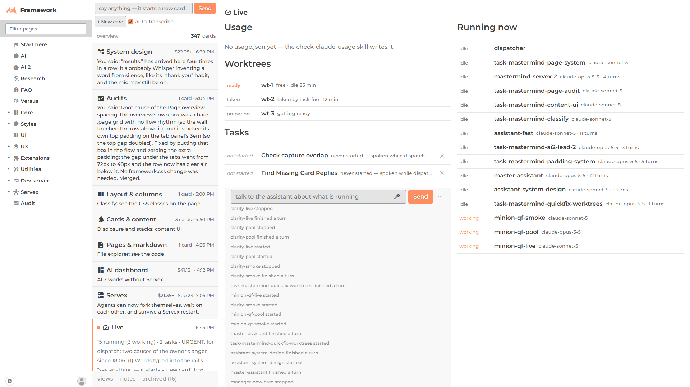

# Live card shows the worktree pool

The Live card (`/framework/ai2/live/`) now has a small **Worktrees** list under the usage meters: one row per slot, saying **ready** (bold orange, "free · idle 25 min"), **taken** ("taken by task-foo · 12 min") or **preparing** ("getting ready").

It reads `GET <servex>/api/worktrees` every 30 seconds. If Servex has no such route yet, the list simply does not appear.

At a glance the free slot stands out. Taken and preparing rows look the same plain colour; only the words differ.

Files: `public/framework/ai2/live.js`, `ai2.css` (one rule, `ai2-live-ready`). The layout check shows only the browser's own 404 line for the missing route.
