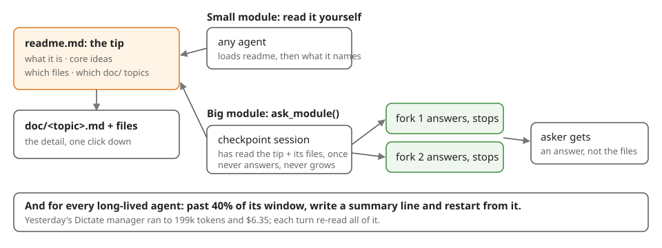

**Every module gets a short readme as the way in. The big ones also get a ready agent you can ask a question. No agent grows old.**

## 1. The readme is the skill

Every module's `readme.md` is the tip of the iceberg: what the module is, its two or three core ideas, the files to read, and the `doc/` topics, one line each.

It has a budget of about 150 words, and everything longer moves into `doc/<topic>.md` with a link. Any agent that needs the module loads the readme first, then only what it names. This is the source of truth, and it costs nothing to run.

## 2. Big modules also get `ask_module(path, question)`

For a module too big to read cheaply (Servex, core/Page, ext/Chat), Servex keeps one **checkpoint** session: a fresh agent that has read the readme and the files it names, and nothing else. It never answers anything.

Each question is answered by a **fork** of it, which answers in a few sentences and stops — the checkpoint never grows, and the asker gets an answer instead of a pile of files.

Measured yesterday, a fork reused 98% of its context from cache and cost $0.014. The checkpoint rebuilds when the readme or a named file changes.

## 3. No long-lived agent passes 40% of its window

At about 40% of its window, a manager or mastermind writes a summary line into its card or task log and restarts from that line. Yesterday's Dictate manager reached 199k tokens and cost $6.35, and every turn re-read all of it. Servex already has the pieces: the `context` count in `list_agents`, and the recycle step for card agents.

## The choice, and the alternative

**Chosen:** 1 and 3 now, and 2 for the five biggest modules. The readme is always what a checkpoint is built from, so the two can never disagree.

**Alternative:** a standing agent per path. It answers faster, but it keeps growing: it is the same problem that §3 fixes.

**Why not readmes only:** reading a 4,000-word module costs every asker the whole read each time, while a fork of a checkpoint pays that read once.

The brief to build it is in [ai/todo.md](/framework/ai/todo.md).
