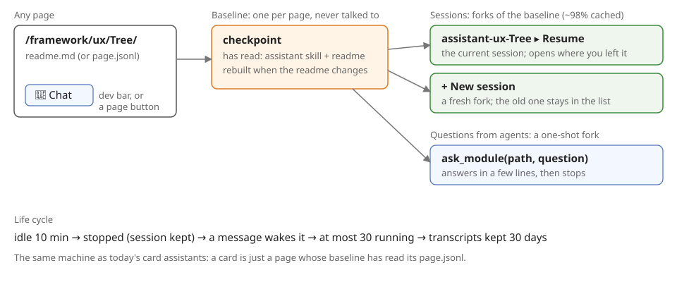

**Every page on the site gets an assistant, just like every AI 2 card has one now. Open the chat on any page and it carries on where you left off.**



```
assistant-<page path>    one per page (Layers.js)
├── baseline   has read the readme; never talked to
├── sessions   forks: ▸ Resume · + New session
└── questions  ask_module(): one answer, then stops
```

- [x] **Card assistants exist** (`Servex/agents/Layers.js`): one per card, with an id minted from the card's path, a session that resumes, and a stop after 10 idle minutes.
- [x] **A fork that stays alive exists**: `spawn_agent` with `resume` plus `fork` (98% cached, measured). `fork_self` answers once and stops.
- [ ] **Key by page path, not only by card:** a card is a page whose baseline reads its `page.jsonl`.
- [ ] **The baseline checkpoint**, rebuilt when its readme changes (it's keyed by a hash of the readme).
- [ ] **The chat on every page**: the dev bar's chat, plus a button. It reuses the Live card's agent conversation view.
- [ ] **At most 30 running**: this was proposed on 2026-09-24, and it's not in Servex code yet.
- [ ] **30-day transcripts**: `cleanupPeriodDays` isn't set, so the default is 30. The history is deleted after that, and a baseline older than that is rebuilt on its next use.

This replaces the ready agent in [module agents](../design.md): one checkpoint per path serves both you (a session) and agents (`ask_module`). The build brief is in [ai/todo.md](/framework/ai/todo.md), under "An assistant on every page".
