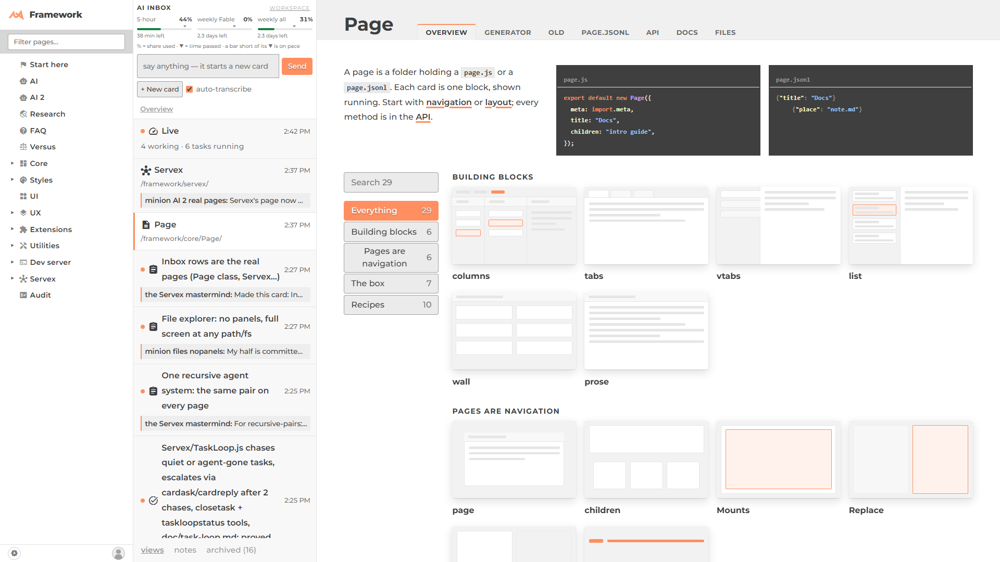

# Two answers: an inbox row that is a real page



## 1. Can AI 2 show any site page, as the same page?

**Yes, with no change to core.** `/framework/ai2/framework/core/Page/` shows the page that lives at
`/framework/core/Page/`. It is the same Page object with the same view, not a copy.

How it works: AI 2's `route()` claims the name `framework`. It answers with a small page class,
`RealPage` (in `ai2/real.js`), which claims every deeper name the same way. Each `RealPage` asks the
Router's own lookup (`router.load_segments(path)`) for the real page. That is the same walk a direct
visit makes, so the real page keeps its own parent, url and children. The real page's cached view is
then moved into AI 2's detail column. The page is never adopted and never re-addressed, so opening
`/framework/core/Page/` directly still works exactly as before (checked, zero errors).

What could have broken, and what happened to each:

- **Its tabs** work. A link inside the page to another `/framework/` page is caught and opened
  inside the inbox: `…/ai2/framework/core/Page/api/`. The tab page mounts where it always does, in
  the Doc's own tab panel. Back, reload and pasting the url all land on the same tab.
- **Its own `children:`** are untouched, because the page is never adopted.
- **The `.active-page` marks.** The Router only marks AI 2's own chain, so `RealPage` marks the
  real pages itself and takes those marks off when you leave. When you go from the inbox straight to
  the real page, it leaves the Router's own marks alone. The tab bar's `.active` is marked against
  the real url.
- **Sidebar nav** is unchanged. AI 2 is a `leaf`, so visited paths never become nav rows.
- **Relative urls** are fine, because modules resolve against `import.meta`, never the document.
- **Kept mounted.** When you leave, the real page stays in its box, hidden. When you come back, it
  is the same element (measured) and only the marks change.
- **The drawer** is told which page is showing: `drawer.page("/framework/core/Page/")` when the
  page opens, and `drawer.page(null)` when you leave it for anything that is not a real page. It is
  called once per navigation. **The page-drawer worktree has `drawer.page()` but has not committed
  it yet**, so here the call is guarded (`drawer.page?.()`). It was proved by recording the calls
  (open: `"/framework/core/Page/"`; leave: `null`), not by a picture of the drawer.
- **Not shown inside:** AI 2 itself, or its own ancestors (the site root and `/framework/`). Moving
  those would move the inbox into itself, so that address draws a link instead.

## 2. How does a row know its page?

**Events keyed by the page's path.** A line in a log the rail already streams names the page it is
about, with a `"page"` field:

```json
{"log": {"at": "…", "page": "/framework/core/Page/", "by": "minion-x", "msg": "what happened"}}
```

Two logs are read. The first is today's `ai/<date>/day.jsonl`. The second is every task log of the
last two days, which the groups already read. On a task log the line can be any verb, such as a
`log`, a `decision` or a `note`. Any path that is named gets a row. The row's title and icon come
from the real page. It sorts by its newest event, like every other row. Its sub-line is the same
"what happened" bar a card has, and the bar clears once you open the page. No card is made and no
registry is kept. The Servex row came for free: `/framework/servex/` works the same way.

**The alternative, not chosen:** a log the page owns itself, kept beside its `page.js`. A
`page.jsonl` there is the obvious name, but the obvious name is a trap: `Page.load()` reads
`page.jsonl` as the page itself. If the page had its own log, it would need another name, such as
`activity.jsonl`. The rail would also have to stream one file per page. That fits better once tasks
live in class folders (`proposal-tasks.md`), but it is not the smallest version.

## Found on the way (fixed)

Every AI 2 load threw `this[verb] is not a function`, the main site too. The cause was a line in
waiting-on-you's `task.jsonl`, `{"assign":{"agent":…}}`. It replays as a data field on top of the
`agent()` method, so the next `agent` line crashed. `Member.apply` in `ai2/groups.js` now gives the
method back. **The same trap is in `ext/JSONL`'s `TaskJSONL` for every reader.** That file is outside
this fence. The core-side fix is the same two lines in `JSONL.apply()`.

## Pictures

- [Page row opened, 1920](shot-page-row-1920.png) · [3440](shot-page-row-3440.png)
- [Its API tab, inside the inbox](shot-page-api-tab-1920.png)
- [The Servex row](shot-servex-row-1920.png)
- [/framework/core/Page/ opened directly, unchanged](shot-direct-core-Page-1920.png)
