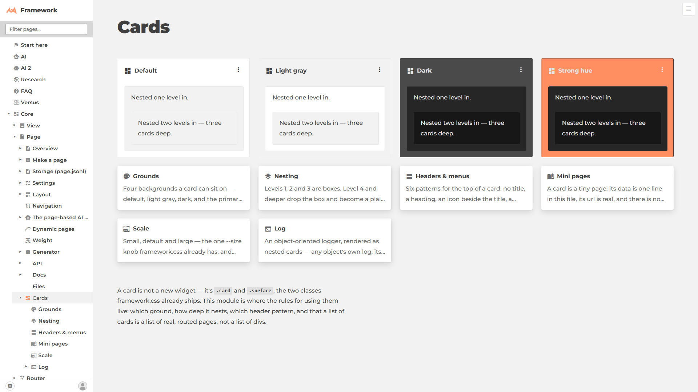

verdict: fix
1. [fix] The wire work is not committed, but the brief says "Commit by exact path". `git status` in the worktree shows core/Page/page.js, core/Page/readme.md, card/page.js, card/mini-pages/MiniPages.js, card/inventory.json and card/doc/inventory.md all still modified. Because of that, review/diff.patch shows the older branch commits, not this change: it still has the old Concepts-tile card/page.js, so the patch cannot be used to review this work.
2. [note] Brief items 1–3 are done in the working tree. `card` sits in core/Page/page.js:66 after `weight`, the readme line is word for word at core/Page/readme.md:21, and card/page.js:47–55 goes live sample → preview wall → a two-sentence paragraph. Every sample class exists in card.css (lines 21–69), so nothing new was added.
3. [note] card/page.js:26 (and headers/page.js:29,42): the ⋯ menu is `<a href="#">`. It opens nothing, and a click adds `#` to the url. A `<button>`, or a link to the headers/ page, would be honest.
4. [note] MiniPages.js:55 has a sensible local fix for the `card` method hiding Page's `card` class string. The collision itself is a trap for any other page.jsonl verb named after a Page property, so worth a line in the page skill's improvements.md, or renaming the verb (e.g. `mini`) instead of patching preview().
5. [note] Page-card/sheet.png: order is right — at 1920 the four grounds fill one row, six previews below. At 1280 "Strong hue" wraps alone onto a second row; a `--column` near 16em keeps all four in one row. At 3440 the previews stop near two-thirds width (72% empty) while the samples stretch wide.
6. [note] The preview tiles in Page-card/sheet.png are text-only, and their descriptions are cut off after about two lines. A reader can find all six, but nothing shows what each one looks like. A small picture per tile would fit "show, don't tell" better.
7. [note] Page-card-mini-pages/sheet.png (not in this fence, from an earlier commit): the dark "Going deep" card's text is almost invisible, dark on dark, at all three widths. The `a.card.card-dark` probably picks up the link or text color instead of the dark island's.
8. [note] In Page-card/sheet.png, the Default sample's nested level-2 card is the same gray as the Light gray ground beside it. So in the row, the first two samples read as nearly the same thing.
