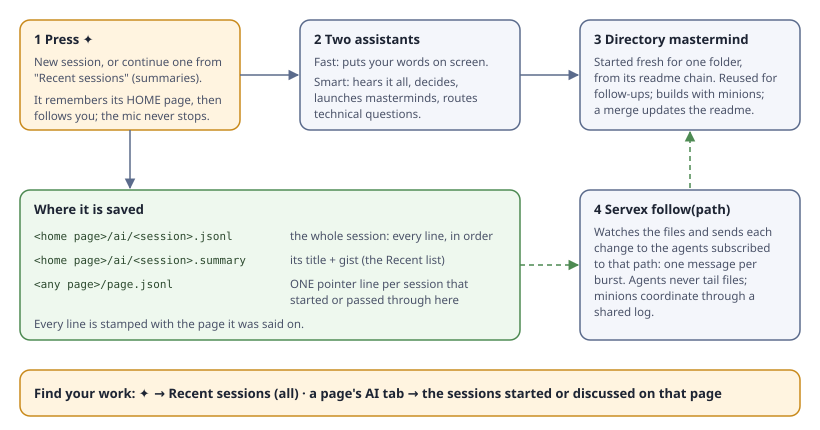

# Voice sessions: the design

Press ✦ and talk. A **session** starts on the page you're on (its home), follows you as you move between pages, and never stops while it's recording. Everything it hears is saved in one file under its home page. Every folder it passed through gets one line in its `ai/log.jsonl`, so you find your work either in ✦ → Recent sessions or in that page's AI tab.



## What goes where, and where you find it

| Thing | What it is | Saved at | You find it in |
|---|---|---|---|
| **Session** | One conversation: your words, the assistants' replies, and the cards placed in it. There is ONE kind of session. | `<home page>/ai/<session>.jsonl`, append-only, every line stamped with the page it was said on | ✦ → Recent sessions, or the AI tab of its home page |
| **Session summary** | Its title and gist, rewritten by the smart assistant as it goes | `<home page>/ai/<session>.summary.json` | The Recent sessions list: continue any one by its id |
| **Directory AI log** | A MINIMAL index of AI work in one folder, most important first. Presence only: a session started or ended (with its title), a task opened or landed, a decision. Each line points at its detail file. No step updates; those stay in the session or task log | `<dir>/ai/log.jsonl`, in any folder that has AI work (the owner, about 8:00 PM). Replaces the old pointer line in `page.jsonl` | A page's AI tab and Recent sessions read it. The SMART assistant writes it in real time, so a pair stopped for idling loses nothing |
| **Navigation** | Where you went while talking: `{at, from, to}` | Inside the session file, as lines | The assistants see it, so they know which page you mean |
| **Fast assistant** | Puts your words on screen as fast as possible. Nothing else. It and the smart assistant are the only ones that see your raw words (the echo). | Runs only while the mic is on | — |
| **Smart assistant** | Hears everything and knows what is in flight: every task, who runs it, who started it, on which page, and how to reach it. Talk on any page about work started elsewhere and it **routes** your words to the mastermind already doing it, never a duplicate; related work goes to that same mastermind or worktree. Masterminds never get your raw words: it sends a **polished** message made by `Server/refine.mjs` (with its coverage table, so nothing is dropped). It also makes the decisions, launches new masterminds, and routes technical questions | One per session. Its model comes from `Usage.pick()`: higher late in the week with usage to spare | Its replies are lines in the session |
| **Directory mastermind** | Answers a technical question, or does a task, about one folder | Started FRESH from that folder's readme chain (same prompt every time, so it's cached). Reused for follow-ups in the same session; a new topic gets a new one | Its task folder under `ai/<date>/`, linked from the session |
| **follow(path)** | How an agent keeps up with a file: Servex watches, and sends each change to the agents subscribed to that path, one message per burst | A Servex tool; built first (row 39) | — |

## The rules behind it

- **Our own session files, not Claude Code's transcripts.** A session is our log plus our summary, so a future OpenRouter or home-built harness session works the same way and resumes by id.
- **One chat line for everything.** Text, voice and AI replies share one shape, drawn by one widget (ext/Chat's ChatPanel):
  ```json
  {"chat": {"at": "…", "session": "v-7f3a", "path": "/framework/core/Page/",
            "from": {"kind": "owner|assistant|agent", "id": "…"},
            "via": "voice|text", "text": "…", "re": "<at it answers, optional>"}}
  ```
  A line may carry `"place": {"module": "…/Question.js", "id": "q-…"}` instead of `text`, to put that thing in the flow. A correction is a new line with the same `at` and `"fix": true`; the latest one wins, and nothing is edited in place.
- **How big a jsonl can get.** Measured on this machine, Node reads and parses about 3.3 ms per MB: 1 MB (about 3,200 chat lines) takes 4 ms, 5 MB takes 17 ms, 20 MB takes 68 ms and 50 MB takes 162 ms. Parsing is never the slow part. Sending the file to the browser and drawing its lines is ([the 3.3 MB directory.json made card pages about 3 s late](../slow-card-fix/measurement.md)). **Keep any file a page loads under about 1 MB.** An hour of talk is roughly 500 lines, about 150 KB, so one file per session stays small. page.jsonl stays small too, because it gets one pointer per session.
- **Readmes are always current.** Every mastermind starts from a blank slate. A question changes nothing; a merge updates the readme and docs.
- **The build order, in every task:** build in the worktree → update the docs → a FRESH mastermind reads only the docs ("is anything unclear or missing?") → the fresh-eyes review → merge. This is now in the sub-mastermind, minion, documentation and finish-task skills.
- **Minions coordinate through a shared log** that they write and `follow`, not by messaging each other one to one.

## Considered and rejected

- **Two kinds of session** (a dark dev rail that follows you plus a light per-page button). Rejected by the owner at 7:10 PM as too complicated.
- **A page session that stops on navigation.** Cutting off mid-thought is what the owner hates most.
- **Copying every line into each page's page.jsonl** (my 7:05 draft). It makes page.jsonl grow with every sentence; one pointer per session does the same job.
- **A pointer line per session in `page.jsonl`** (slice 1). Replaced at about 8:00 PM by `ai/log.jsonl`, which also carries tasks and decisions, and keeps page.jsonl for the page itself.

Source: the owner's words in [../audio/owner-words.md](../audio/owner-words.md), from 6:30 to 7:10 PM. Every sentence is traced to an ask in [refine/coverage.md](refine/coverage.md) (6:30), [refine-640/coverage.md](refine-640/coverage.md) (6:40), and [refine-655/coverage.md](refine-655/coverage.md) (6:55 and 7:05: 54 sentences, 0 dropped). The brief is [requirements.md](requirements.md).
