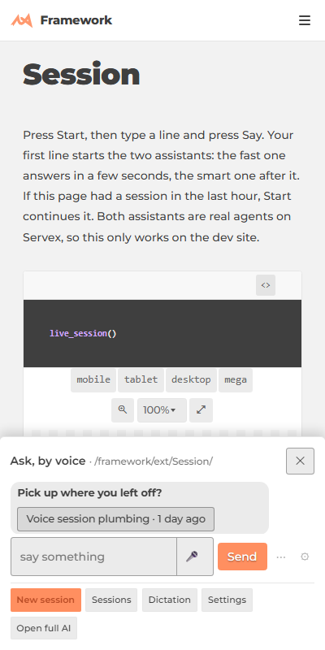
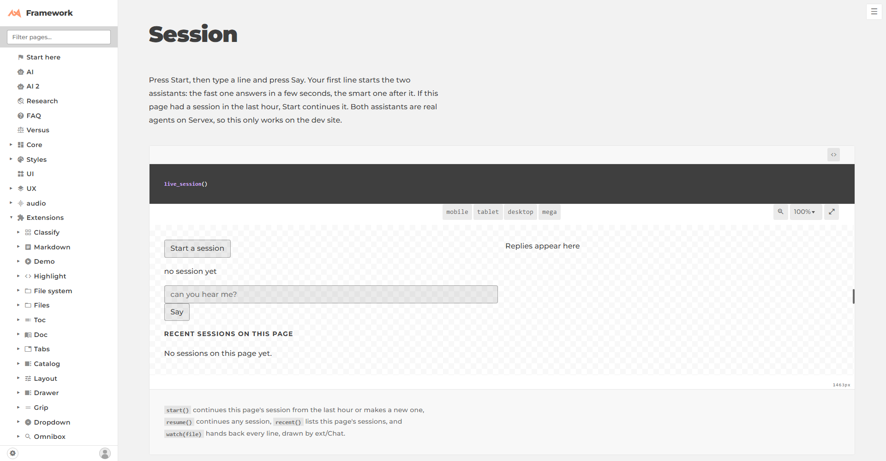

# Voice sessions: what landed

Press ✦ and talk. One session follows you from page to page, a **fast** assistant answers in about a second, and a **smart** one answers after it. Try it on [/framework/ext/Session/](/framework/ext/Session/) (the demo) or on the ✦ sheet on the phone.

 

Merged into michael/dev as ced6b950, 53b297cc and d9dcbc9c. **The last two go live after the Servex restart** that the Servex mastermind is holding.

## The asks, each with its proof

- [x] **Fast and smart pair per session.** Live test: fast reply in 1.1 s, smart in 4 s ([task.jsonl](task.jsonl), experiment 19:30).
- [x] **One session per ✦ press, with its home page and a nav line per route change.** [a-slice1](a-slice1/task.jsonl).
- [x] **No leaks:** a pair starts on the first sentence, stops after 5 idle minutes, resumes by id, and at most 2 pairs run at once ([b-slice2](b-slice2/task.jsonl)).
- [x] **Resume within the hour; an older session offered as one line** ("Voice session plumbing · 1 day ago"): shots in [e-fixes](e-fixes/) and [f-dupe-line](f-dupe-line/).
- [x] **Titles and summaries, per-folder `ai/log.jsonl`, raw → revised lines (`level`)**: [b-slice2](b-slice2/task.jsonl).
- [x] **Don't reply while I'm talking:** the fast reply is held until the floor is "done" (e-fixes experiment).
- [x] **Phone and PC share sessions** (keyed by project, not host).
- [x] **Directory mastermind (`ask_directory`):** fresh each time, with the same opening every time, reused for follow-ups (71,577 cached tokens read on the follow-up). See [d-directory](d-directory/task.jsonl) and [/Servex/agents/doc/directory.md](/Servex/agents/doc/directory.md).
- [x] **`Usage.pick(role)`**: in ced6b950.
- [x] **One name per role:** [roles page](/framework/ai/2026-09-22/tiers-design/doc/roles.md).
- [x] **One live log per task: `task.jsonl`** ([c-roles](c-roles/task.jsonl), [AITask readme](/framework/ext/AITask/)).
- [x] **Card pages reach the same pair** (the Servex side): [g-card](g-card/task.jsonl).
- [x] **The echo pattern:** a mastermind `follow`s the session file (decision `d-hear`).
- [ ] **Phone proof: start the mic and follow three links.** Not run: it needs a real phone and a real mic.
- [ ] **Each page's AI tab shows its sessions.** This is drawer code, owned by audio-consolidate / the Servex mastermind.
- [ ] **Card pages calling it:** the page side belongs to audio-consolidate (ask 5).

## Reviews

- A fresh docs check found 5 gaps; all were fixed ([docs-check.md](docs-check.md)).
- Fresh review 1 had 12 findings: 10 were fixed, 1 was routed to the rail's owner, and 1 was declined ([review-fresh.md](review-fresh.md)).
- Review 2 had 11 findings: 10 were fixed, and 1 was ruled "stands" ([review.jsonl](review.jsonl)).
- The card review passed.

## Left, on purpose

- No walkthrough page yet: audio-consolidate is replacing the sheet's widget now, and a walkthrough should follow that.
- The worktrees `voice-fixes` and `voice-card` are left on disk. Both branches are merged, and only the watcher's `files.jsonl` differ.
- `session-` is not yet in `styles/css-scopes.txt` (see [ext/Session/doc/decisions.md](/framework/ext/Session/doc/decisions.md)).
