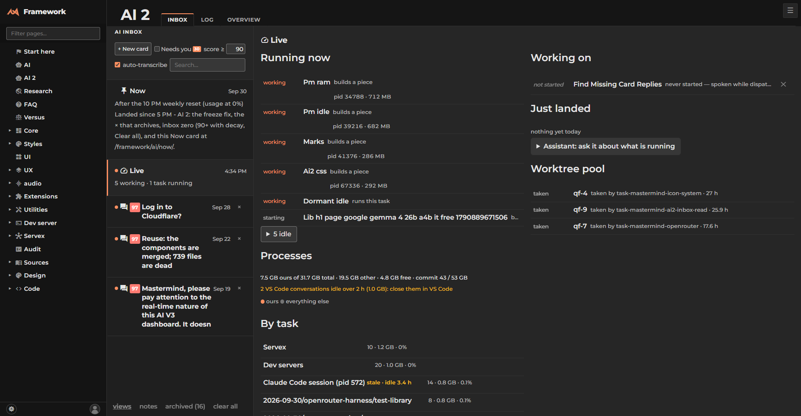
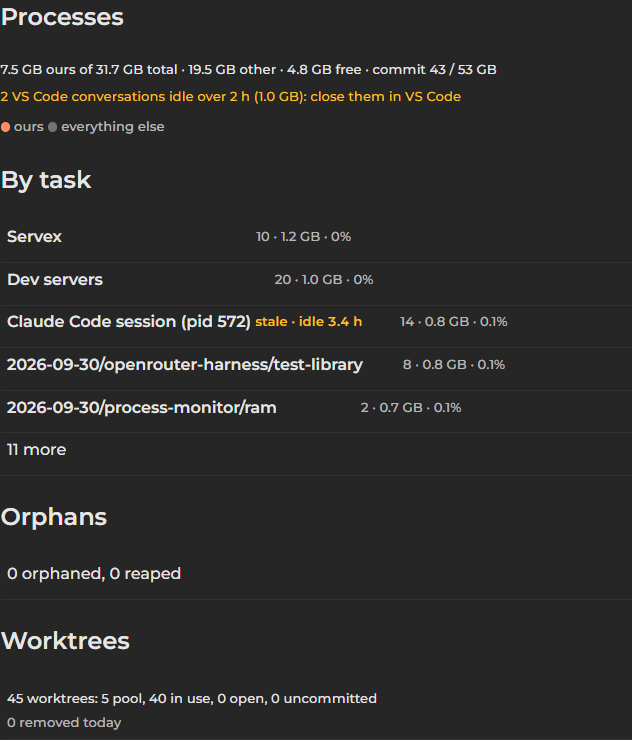

# Idle: stale VS Code conversations, idle-gated game close, commit charge — report

Built in `C:/Code/lew42/worktrees/pm-idle`, branch `worktree/pm-idle`. Asks 3, 4 and 5 from
[process-monitor](../requirements.md)'s "the RAM squeeze, measured" section.

## What you see

The totals line now ends **"commit 43 / 53 GB"** (ask 5) — the machine's RAM plus whatever has
spilled to the pagefile, which is why it can look worse than "4.8 GB free" alone suggests. Right
under it, in orange, the stale-session line (ask 3): **"2 VS Code conversations idle over 2 h
(1.0 GB): close them in VS Code."** Scrolled to "By task":

**Claude Code session (pid 572)** carries its own **"stale · idle 3.4 h"** badge right on the row.
Nothing is closed automatically — the owner closes a VS Code conversation themselves; this only
flags it.

## Ask 4: games, closed only when idle AND RAM is tight

New `Servex/Games.js`. Every minute it checks three things, all off the process monitor's own
snapshot (no PowerShell of its own): idle time past 30 minutes (`GetLastInputInfo`, read by the
same long-lived hidden PowerShell the process monitor already runs), free RAM under 6 GB, and a
listed game (`StarCraft.exe`, `SC2.exe`, `SC2_x64.exe`, `Battle.net.exe`, or `SERVEX_GAMES`)
actually running. The whole rule is one pure, exported `decide()` function — no PowerShell, no
Servex — so the proof checks the owner's exact edges directly: idle 29 minutes (no), 8 GB free
(no), no game running (no). Closing tries `CloseMainWindow()` first and only `taskkill`s the same
pid if it is still alive 60 seconds later, so a relaunch is never touched. `SERVEX_CLOSE_GAMES=0`
only logs what it would have closed. No Live card UI for this — the brief only asked for the field
and the log line, both done.

## What changed, file by file

- `Servex/Processes.js` — the PowerShell loop now also reads idle seconds and the commit charge
  each tick; a `session` group gets `stale`/`idle_h`; `sessions{}` and `commit_mb`/
  `commit_limit_mb` are in `/api/processes`; one clause added to `line()`.
- `Servex/Games.js` (new) — the rule above.
- `Servex/Servex.js` — starts and stops `Games` the way `Processes` does.
- `Servex/doc/processes.md` — one section each for stale sessions, games, and the commit charge.
- `public/framework/ai2/processes.js` / `ai2.css` — the badge, the totals line, and the commit
  figure, prefix `ai2-proc-` throughout.

## A judgment call worth naming

The brief says to read free RAM from `servex.processes.now.free_mb`. That property name is already
taken — `Servex.js` keeps a `Map` of dev-server runners at `this.processes`. The process monitor
itself is `this.procmon` (see `Servex.js` line ~214). `Games.js` reads `this.servex.procmon.now`
and `.procmon.procs`, the real property, not the one the brief's prose named.

## Proof

`node Servex/processes.test.mjs`: **35 checks pass**, including a session idle 3 h (stale) vs. 1 h
(not), and the game rule at the owner's exact edges (idle 29, 8 GB free, no game running — all
"no"). The worktree has no `node_modules`, so the Live card shot above used a small
zero-dependency static file server (mirrors `Server/server.js`'s own static-plus-fallback) instead
of the full dev server, with `**/api/processes*` intercepted by Playwright (`Server/browser.mjs`)
and fed a real snapshot from the live site, edited to add two stale sessions and the commit
figures. Zero console or page errors other than the dev-only live-reload websocket failing to
connect against that plain static server, which is expected and unrelated to this change.

## What was left

- No Live card UI for `games_closed` — not asked for (ask 4 only asked for the field and the log
  line); it is live in `/api/processes` and `Servex/doc/processes.md` shows its shape.
- The RAM/CPU graph is absent from the screenshots above only because the sample snapshot was
  fetched with `?history=0` (no history points) — unrelated to this task; the graph itself shipped
  with the sibling `graph` subtask.
- Not yet merged — this report is written before the mastermind's smoke test and merge
  (`Server/merge.mjs`), per the usual build order.
