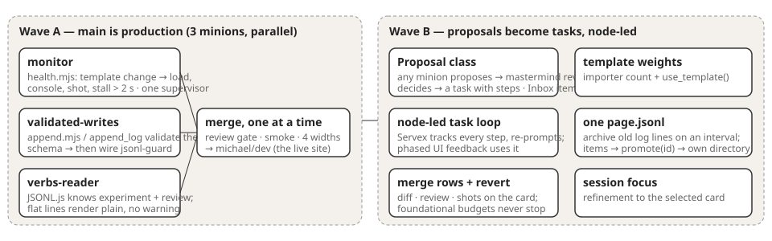

# Proposal flow — the plan

**Wave A first (the owner, 16:30): the main branch is production.** Three minions, in parallel, in one worktree (`worktree/proposal-flow`), each with its own files, each merged on its own through the review gate:

| Minion | Builds | Proof |
|---|---|---|
| [monitor](monitor/requirements.md) | `Server/health.mjs` checks a **template** change (JS, CSS, HTML, page.js), never a log append: load the pages, console errors, a screenshot, stalls over 2 s, unknown-verb warnings counted. Reports to the editor (as today) and the dashboard. One `health-supervisor` instance. | break a page in the worktree → the finding and the shot; append a log line → no check; a 3 s busy page → flagged |
| [validated-writes](validated-writes/requirements.md) | `append.mjs` and `append_log` validate each line against the file's schema (task, day, page) and refuse an unknown verb or a flat line, naming the right shape. Skills and scripts point at the tool. **Then** `jsonl-guard.mjs` is wired as a PreToolUse hook. | a shell `>>` to a .jsonl is refused with the pointer; a flat line is refused; `experiment` and `review` pass |
| [verbs-reader](verbs-reader/requirements.md) | `ext/JSONL/JSONL.js` renders `experiment` and `review`; a flat line renders as a plain log line without a warning. | `/framework/ai2/` loads with zero `unknown verb` warnings (headless) |

**Wave B after A lands:** the `Proposal` class and the node-led task loop (items 1–5, 7), merge rows with approve/revert and foundational budgets (6a, 6b), template weights (6c), one page.jsonl with archiving and promotion (6d, 6e), session focus. Briefs are written when A merges, from what A taught us. The alternative — one task mastermind for all twelve items — was dropped: the owner said the architect builds this with its minions, and the first four items are independent enough to run side by side.

Card: [/framework/ai/2026/09/30/proposal-flow-main-is-production-then-pr/](/framework/ai/2026/09/30/proposal-flow-main-is-production-then-pr/)
