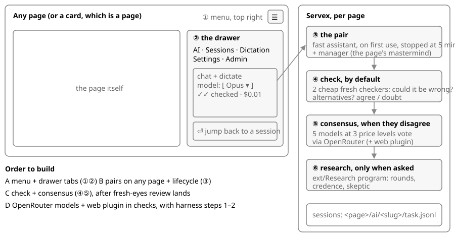

# Agent work on every page: the design

**One idea:** every page is a context. A card is a page too. Each context gets its own agents, sessions and checks, all reached from one menu at the top right.

| Part | What it is | Built on | Step |
|---|---|---|---|
| ① Menu | A ☰ button, top right, on every page | site chrome in `public/app.js` | A |
| ② Drawer | Tabs: AI (chat and dictate, with a model picker), Sessions, Dictation, Settings, Admin | `ext/drawer` (already opens on any page); the card's composer moves in | A |
| Sessions | Every thread on this page; click one to jump back in | the dev bar Ask's store: `<page>/ai/<slug>/task.jsonl` plus `chat_session_id`, one store for pages and cards | A |
| ③ Pair | A fast assistant, made on first dictate or chat and stopped after 5 idle minutes, plus the page's manager (its mastermind) | `Layers.record()` generalized from a card to any path; the lifecycle in recursive-pairs | B |
| ④ Check | By default, after a decision or an answer: 2 cheap, fresh checkers ask whether it could be wrong and what the alternatives are. The result is one `{"check":…}` line and a ✓✓ chip. Target under $0.01. | the spawn code of `Server/review.mjs` (fresh eyes); Haiku and Sonnet today | C |
| ⑤ Consensus | When the checkers disagree, or the truth is unclear: 5 models at 3 price levels vote, and the tally shows on the card. Target under $0.05. | OpenRouter, once harness step 2 makes `provider` live | C, D |
| ⑥ Research | Only when someone asks for a program. ext/Research (about 1,500 lines, with credence and skeptic rounds) is too heavy to be the default. | ext/Research, unchanged | — |
| Web search | Claude agents keep their built-in WebSearch. OpenRouter checkers use its `web` plugin (Exa, about $0.007 a request). Our own search tool (Serper, about $1 per 1,000) only if we build our own loop. | OpenRouter; harness step 7 | D |

**Why not ext/Research for everything:** a research entry takes a topic, kind, credence and summary. A sanity check needs one line and a verdict. Research stays for a question that deserves rounds.

**The dev bar** stays as it is for now. Its Ask threads move into the drawer's Sessions tab, and its own panel is retired later.

## Added: one collaboration system for research, planning and design (owner-words-2.md)

Research is a consensus operation, so there is one system and not a research project per task. A mastermind runs it by itself, nearly always with a vote and a rough web search.

| Object | Properties | What it does |
|---|---|---|
| `Collab` | question, members[], phases[], winner | the whole run; one `collab.jsonl` in the task dir, so the UI can draw it |
| `Member` | id, model, price, dir | writes only into its own `collab/<id>/` in the shared worktree |
| `Phase` | kind (brief, read peers, revise, vote, implement, cross-review), round | runs in order, never a free-for-all |
| `Vote` | member, pick, caveat | a favourite plus the one improvement it would add; the winner absorbs the caveats |
| `Source` | url, kind (docs, source code, article), authority, md path | one page of the source library, already converted to markdown |
| `Lesson` | text, sources[], where | filed in the `doc/` of the module it is about |

**The rounds:** everyone does the brief → each reads 1 or 2 peers → revises their own → votes with a caveat. The mastermind reads only the tally, the winner and the caveats, never every draft.

**Object-oriented design votes in stages:** names first (the class, its properties, its methods and their arguments) → everyone implements the agreed names → cross-review (are the versions functionally the same?) → vote on the best, with caveats.

**Web fan-out:** cheap members search, then search again from what they found, preferring documentation sites and GitHub source. Each page is saved once as markdown in `public/framework/sources/<topic>/`, with an `index.jsonl`, so any agent can cite it.

**Docs:** the folder is `doc/` (75 modules use it; the one `docs/` is a layout's name, not a doc folder). `/docs/` redirects to `/doc/`, and the Docs tab shows any depth of nested markdown as a tree (ext/files). Everything filed there is browsable, not only readable by agents.

| Build | Task |
|---|---|
| The cheap default: `check`, and `consensus` with the `Vote` shape above | check-consensus (running) |
| `Collab`, the rounds, the staged design vote, and a skill for masterminds | #10 collab-rounds |
| The source library, the web fan-out, lessons, and the doc/ convention with nested navigation | #11 source-library |
