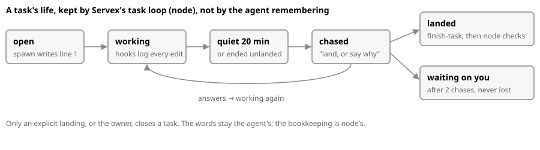

# Skills as a workflow: node keeps the books, skills say what to write

**Measured (tasks from 2026-09-20 on, 132 in all, from the Skill hook's `skill:` log lines):** finish-task was loaded 59 times, documentation 24, code 15, layout 11. Agents hosted by Servex may not reach the hook, so these counts are a floor. Either way, a skill the agent must remember is loaded less than half the time, so anything that must happen moves into node.

| Step | Today: the agent remembers | Build: node does it | Owner |
|---|---|---|---|
| Open a task | the new-task skill | `spawn_agent` with a `task` field writes task.jsonl line 1 (session id, card, brief) before the agent starts | task-loop |
| Load the right skills | the agent picks them | the role's skill list in `roles.js` goes into its first turn (one skill today, a list tomorrow) | task-loop |
| Log, cost, checks | done already | hooks, on-landing.mjs, review.mjs | — |
| Docs current | the documentation skill (24 of 132) | on-landing runs a doc check (touched module has readme, doc/ and resolving links) and posts a nag on the card | task-loop |
| Close | finish-task | still the agent's words; node refuses "landed" without an outcome and marks it on the card | task-loop |
| Chase | nobody | **the task loop** in Servex: every 5 min, an open task quiet for 20 min, or whose agent ended unlanded, gets "land, or say why" (the agent is woken). After 2 chases it goes to Waiting on you | task-loop |
| Idle agents, stop and resume | — | the lifecycle rule | recursive-pairs |
| Skills and tools for non-Claude models | — | how the harness delivers them | harness plan |

**Skills with arguments:** the Skill tool already takes an `args` string. The rule: a skill is the contract (when and why, in plain words), and each skill that must *do* something is backed by one tool (`task_open`, `task_land(outcome)`, `check(claim)`), so the doing is node. Under an OpenRouter harness nothing changes: a skill is markdown loaded into the prompt on its trigger, and the tools are the same in-process functions. Only the loader differs, and that's the harness plan's.
