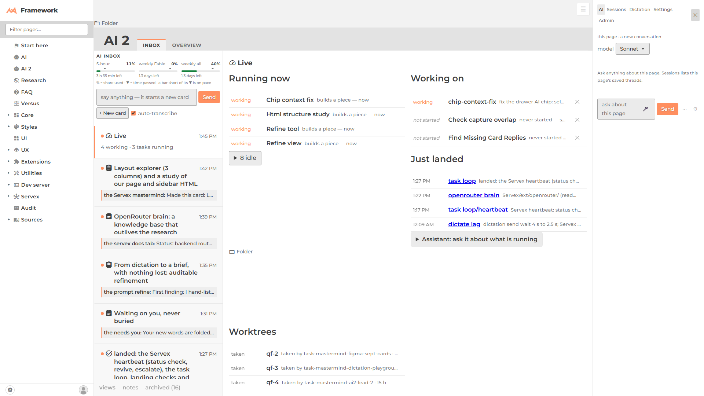
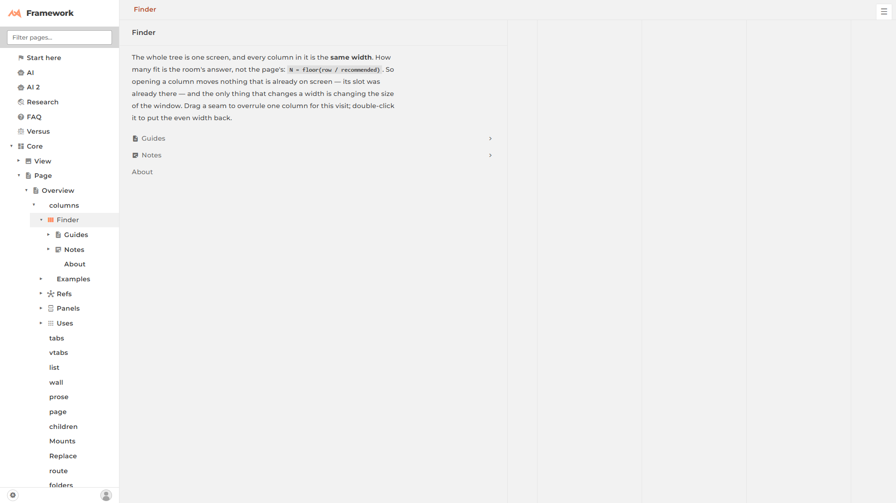
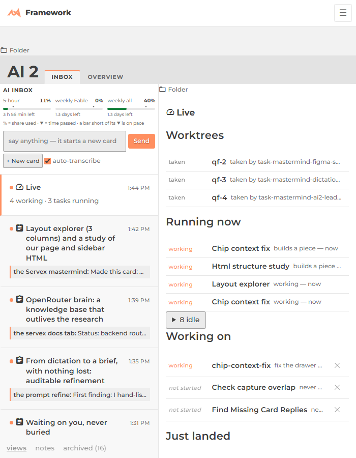
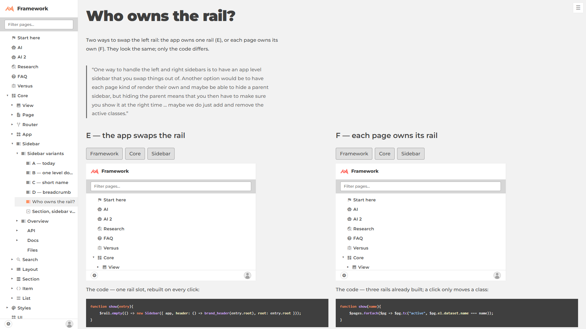

# How our pages are actually built, and where the sidebars live

This study looks at the live page structure (the DOM), not only the code. Each page was loaded in a headless browser at 1920×1080. The full trees, with every box's size, are in [`html-study/`](./html-study/) (`*.tree.txt`).

## The verdict

1. **The app has no sidebar of its own. Each "topic" page builds its own.** The home page and `/framework/` each create a full `Sidebar`. They sit side by side in the app, so on every `/framework/…` URL the home page's sidebar is still in the page, just hidden. The sidebar has no handle on the app: you cannot write `app.left`.
2. **The right drawer is the one piece that is already app-level.** `ext/drawer` puts one drawer in `.app`. When it opens it pushes the pages over (the pages area shrinks from 1920 to 1616 pixels) rather than covering them. Its handle is the imported `drawer` function, not `app.right`.
3. **Build the layout explorer as one page with three regions filled from the page tree.** Do not build it by nesting pages. The detail is under [Recommendation](#recommendation).

## 1. The container tree

Every page follows the same spine. `⚑` marks a structural oddity.

```
body
├─ div.dev-bar                       fixed, parked off-screen at x=1936   ⚑ outside .app
└─ div.app.theme-lew42
   ├─ div.pages                      = app.$pages (the router's region)
   │  ├─ div.page.page-homepage      "/" (active-ancestor, display:none on every other URL)  ⚑ keeps a full hidden Sidebar
   │  │  ├─ div.sidebar > div.sidebar-rail (sticky)
   │  │  └─ div.pages > div.default                           ⚑ single-child wrapper
   │  └─ div.page.page--framework    "/framework/"
   │     ├─ div.sidebar > div.sidebar-rail (sticky, 256px)    = page.$sidebar
   │     └─ div.pages                = page.$pages, where each child page mounts
   │        ├─ div.page.page--core   (active-ancestor, display:none)  ⚑ kept in the page
   │        └─ div.page.…            the active page
   ├─ button.drawer-menu  ☰          fixed, top right   ⚑ floats over page content
   └─ div.drawer                     fixed; when open, app.$pages gets narrower
```

| Page | What sits under `framework › pages` | What is odd about it |
|---|---|---|
| [`/`](/) | *(the home page has its own sidebar and its own `pages > default`)* | `.app > .pages` and `.pages > .default` are both single-child wrappers. Harmless. |
| [`/framework/`](/framework/) | `div.default.flow` | Two `.sidebar`s are in the page; one is hidden. |
| [`/framework/core/Page/`](/framework/core/Page/) | `page--core` (hidden) › `page.doc-page` › `div.tabs` **(contents)** › `tab-bar` + `tab-panel` › `page.doc-section.default` | Every tab is a real page, and the active class swaps which one shows. |
| [Finder](/framework/core/Page/overview/columns/finder/) | `core` › `Page` › `columns` (all hidden) › `page.columns` › `page-columns-row` › `page-column-body` + `page-column-pages` **(contents)** | Four hidden ancestor pages sit above the one that is visible. |
| [`/framework/ai2/`](/framework/ai2/) | `page--ai2` › `ai2-shell` **(contents)** › `div.ai2` (grid) › `ai2-rail` + `ai2-detail` › `page.page--live` › `ai2-full` **(contents)** | 5,005 elements. Contains the page's own inner rail. |
| [`/framework/servex/`](/framework/servex/) | `page.doc-page` › `tabs` **(contents)** › `doc-section` › `page--intro` | Clean. |
| [Sidebar A](/framework/core/Sidebar/variants/a/) | *(nothing; the page moves itself out, see below)* | ⚑ It is placed at the app level, **beside** `framework`, so its four ancestors stay in the page, hidden, including four thumbnail sidebars. |

## 2. Where the HTML and the layout disagree

Three different tricks make the page tree and the screen layout come apart:

- **Column pages** ([Finder](/framework/core/Page/overview/columns/finder/)) nest each child inside its parent's `div.page-column-pages`, which has `display: contents`. That box disappears from the layout, so every descendant column becomes a sibling in one row. The HTML is a tree; the screen shows a row.
- **Tab pages** ([Page](/framework/core/Page/)) keep every tab as a real child page inside `div.tabs` (also `display: contents`). The router adds and removes `.default`/`.active` to decide which one shows. Every tab page stays in the DOM.
- **Moving a page up to the app** ([Sidebar A–D](/framework/core/Sidebar/variants/a/)): the page's `container()` returns `app.$pages`, so the page mounts next to `/framework/` rather than inside it. The URL says it is five levels deep, but the HTML puts it at level one. The home page does the same thing in reverse: it leaves `this.$pages` unset, so that its children do not mount inside it.

All three work. The cost they share is that **every ancestor page stays mounted, just hidden**. That is why there are two full sidebars on `/framework/`, and five hidden sidebars on the Sidebar A page.

## 3. Every sidebar and drawer

| Rail | Who creates it | Handle | Kind |
|---|---|---|---|
| Home nav (left) | root `page.js` → `new Sidebar` | none | persistent, one per topic page |
| Framework nav (left) | `framework/page.js` | `page.$sidebar` | persistent; below 52em it becomes a top bar with a ☰ |
| Variant rails A–D (left) | each variant `page.js` | none | persistent, rebuilt whole for each variant |
| ai2 inbox rail (inner left) | `ai2` page, as a grid column | none (`.ai2-rail`) | persistent and inside the page |
| Drawer (right) | `ext/drawer`, called once by `app.js` via `menu.js` | `drawer()` (the imported module) | push panel, one per document, with tabs (AI, Sessions, Dictation, Settings, Admin) |
| Dev bar (right) | `dev/DevBar` | none | fixed, a child of `body` rather than `.app`, parked off-screen |

## 4. What is broken or awkward

| Screenshot | Problem | Why it happens |
|---|---|---|
|  | A second **"Folder"** link floats in the middle of the ai2 detail pane, at y≈686. The drawer's tab row also wraps "Admin" onto a second line at its 304px width. | The detail page is a grid, and its `a.page-fs-link` lands in a leftover grid cell. The tab row has no rule to fit itself or scroll. |
|  | One 832px column, then **empty column seams** drawn down the rest of the screen. The ☰ sits on top of the column bar. | The row lays out room for columns that are not open yet, and each empty track still draws its border. The ☰ is `position: fixed` and no region reserves space for it. |
|  | At 700px wide, "Folder" appears twice, and the rail and the detail stay squeezed side by side. | The ai2 grid never stacks at narrow widths. |
|  | The demo sidebars stretch to 558px wide; a real rail is 256px. | The stage's grid cell sets the width, and the demos do not use the shared `--sidebar` width. |
| *(no picture: this is structure)* | 2 to 5 full `Sidebar`s are in the DOM on every page, and the ai2 page has 5,005 elements. | Each topic page builds its own sidebar, and hidden ancestor pages are never unmounted. |
| *(no picture: this is structure)* | Two separate right-side systems, the drawer and the dev bar, have different parents and could overlap. | Nothing owns the right edge. |

## Recommendation

**The app has exactly two named, persistent sides, and a page may have its own.**

```
app.left    one Sidebar instance, persistent nav. It never unmounts. When the route changes, it is re-rooted.
app.right   the drawer: one per document, it pushes the page, and it has tabs. The dev bar becomes one of its tabs.
page.left / page.right   optional regions a page builds inside its own view (as the ai2 rail already does)
```

- **Swapping what the side shows.** `app.left` is one instance whose contents are rebuilt. This is variant **E** ("the app swaps the rail"). A page declares `nav: <root page>` (by default, its topic), and the app calls `app.left.root(page)` on each route. This fixes the duplicate hidden sidebars and the "move up to the app" trick, because pages stop building rails. Inside a page, the **router's active class** swaps content (variant **F**), because those contents are pages with URLs of their own.
- **More than one per side.** The app gets one on each side, no more. You get two on the left by nesting: `app.left` plus `page.left` sit next to each other. That covers every case we have without a list of sidebars to manage.
- **Overlay or push.** `app.left` is persistent, collapses to a ☰ top bar below 52em, and never covers the page. `app.right` pushes the page, as the drawer already does. The ☰ button moves into a shell region that reserves its own space, so it stops floating over content.
- **The four variants.** A–D decide what the brand row at the top says. That is a separate question from placement, and any of them fits inside `app.left`. Each of them currently builds its own rail and moves itself up to the app, which is the pattern this recommendation retires.

**For the layout explorer:** build one page, `/layouts/explorer/…`, with three regions: `page.left` (the siblings, as small preview cards), a centre (the selected page's real view, scaled to fit), and `page.right` (its children, as preview cards). All three are filled **from the page tree's data** (`children` plus each page's `preview()`) for the current URL. Going one level deeper re-fills the three regions, so the right column becomes the left.

Do **not** build it from nested column pages. The explorer shows a window three levels wide, and nesting would keep every ancestor mounted, which is the exact cost measured above. Hide `app.left` on this page (the explorer's left rail is the nav there), and leave `app.right` available for properties.

*The owner's aside about a selected element not reaching the AI is a separate task, `chip-context-fix`, which is already running.*
